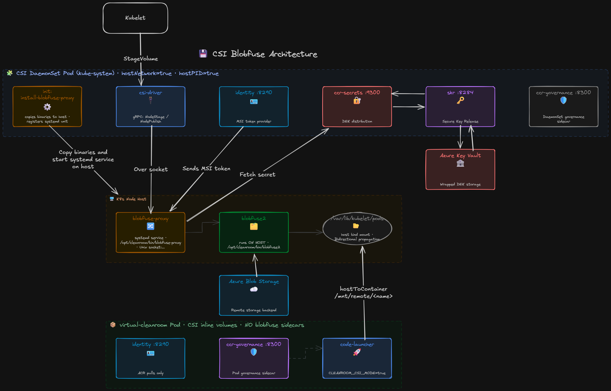

# Clean Room CSI Driver (Prototype)

## Overview
Node-level CSI driver and blobfuse-proxy binary that replaces per-pod blobfuse-launcher sidecars. Supports two deployment modes:

- **CSI DaemonSet mode** (`--use-csi-driver`): `blobfuse-proxy` runs as a systemd unit on the K8s/CVM node host, installed by the DaemonSet init container. The CSI driver sends JSON mount/unmount requests over a Unix socket. blobfuse2 daemons run under `system.slice` and survive CSI driver pod restarts.
- **Proxy sidecar mode** (`--use-blobfuse-proxy-sidecar`): `blobfuse-proxy` runs as a single privileged sidecar inside the CACI/K8s pod, reading all mount requests from the `BLOBFUSE_MOUNTS_JSON` env var (base64-encoded JSON array). No DaemonSet is deployed. `skr` and `ccr-secrets` sidecars remain in the pod.

### Architecture — CSI DaemonSet mode
- **Thin Go shim**: Handles CSI gRPC protocol, ref-counting, and bind mounts. Does **not** call sidecars directly.
- **blobfuse-proxy host service**: Long-running Unix socket server installed as a systemd unit on the Kubernetes node by the DaemonSet init container. The CSI driver sends semantic JSON mount requests (including identity and encryption fields) over the socket. The proxy resolves all sidecar calls (identity registration, DEK unwrap) and invokes `blobfuse2` directly. Because the proxy runs under `system.slice` (not the pod cgroup), `blobfuse2` daemons survive CSI driver pod restarts.
- **DaemonSet sidecars**: Identity (:8290), Secrets (:9300), SKR (:8284), OTEL (:4317), ccr-governance (:8300)

### Architecture — Proxy sidecar mode
- **Single `blobfuse-proxy` container** added to the pod via `--use-blobfuse-proxy-sidecar` CLI flag
- Reads `BLOBFUSE_MOUNTS_JSON` (base64 JSON array), mounts all volumes sequentially on startup, then blocks
- Writes `.volume.ready` markers to the volume-status shared mount so code-launcher can detect readiness
- No DaemonSet; identity (:8290), secrets (:9300), and SKR (:8284) remain as per-pod sidecars

### How it works — CSI DaemonSet mode
1. Pod requests CSI ephemeral volume with `volumeAttributes` (storage account, encryption config, identity client ID, DEK reference, etc.)
2. CSI driver computes a `mountID` (null-byte–separated hash of all config fields including auth fields) and checks its in-memory mount table
3. If the mount already exists and is healthy: apply reader-sharing (ref-count increment for `readOnly` mounts) or return the existing entry for an idempotent re-stage of the same target. For a new writable pod on the same volume, allocate an independent mount slot.
4. If mount doesn't exist: build a `ProxyMountRequest` containing all semantic fields (storage, identity, DEK, encryption mode, `contractId`, `readOnly`) and send it over the Unix socket to the `blobfuse-proxy` host service — **the driver does not call sidecars directly**
5. `blobfuse-proxy` owns all sidecar interaction: registers the MSI identity with the identity sidecar (:8290), unwraps the DEK via the secrets sidecar (:9300) for CSE mounts, then invokes `blobfuse2` directly as a child process under `system.slice`
6. For CSE mounts the proxy performs a two-stage mount: `blobfuse2` SSE layer (`mount-plain`) first, then the encryptor plugin overlay (`mount`) — the driver only sees the final `mount` path
7. CSI driver verifies the staging path is a mountpoint, records the blobfuse2 PID, and bind-mounts the staging dir to the pod target path
8. On pod delete: unmount bind, decrement refcount, send `unmount` to proxy (which cleans up both `mount` and `mount-plain`) + `fusermount -uz` fallback when refcount=0


### Contract routing in CSI mode
- CSI `volumeAttributes` now include `contractId` per volume.
- The driver passes this to identity registration as `governanceApiPathPrefix`
    (`app/contracts/<contractId>`), so `/oauth/token` calls are routed per request.
- The DaemonSet `ccrgovApiPathPrefix` env var remains as a fallback default when
    no per-request override is supplied.

### How it works — Proxy sidecar mode
1. `get_deployment_template()` builds a `blobfuse-proxy` sidecar container with `BLOBFUSE_MOUNTS_JSON` containing all access-point mount configs
2. On pod start, `blobfuse-proxy mount-all` reads the env var, mounts each volume via `blobfuse2`, and writes `.volume.ready` markers
3. code-launcher waits for the ready markers before starting the application
4. All mounts share the sidecar's lifetime; no ref-counting or bind mounts

### Mount sharing policy (CSI DaemonSet mode only)
- **Readers** (datasources, `readOnly: true`): Shared mount with ref-counting. Multiple pods reuse the same blobfuse2 process and cache.
- **Writers** (datasinks, `readOnly: false`): Concurrent writers are allowed. Each writer pod gets its own independent blobfuse2 instance, staging directory, and blobfuse2 cache. The first writer for a volume uses `mountID` as its tracking key; subsequent concurrent writers use `mountID-1`, `mountID-2`, etc.
- **Conflict detection key**: The `mountID` is a null-byte–separated hash of all `volumeAttributes` fields (storage account, container, subdirectory, encryption mode, identity, DEK reference, and `readOnly`). Two mounts that differ in any field — including credentials — get different `mountID` values and are never treated as the same volume.

If a writer's blobfuse2 process crashes, the mount is detected as stale on the next request and automatically cleaned up, freeing the writer slot.

### State recovery (CSI DaemonSet mode only)
On driver restart, in-memory state is fully reconstructed from the host filesystem and kernel:
- **Mount IDs**: Recovered from staging directory entries (`/var/lib/csi/cleanroom/staging/<mountID>/` for readers and first writers, `<mountID-N>/` for concurrent writers on the same volume)
- **PIDs**: Found by scanning `/proc/<pid>/cmdline` for blobfuse2 processes matching each staging path
- **Target paths**: Correlated via `/proc/self/mountinfo` device numbers (staging FUSE mount → pod bind mount)
- **readOnly flag**: Parsed from `/proc/mounts` mount options (`ro` vs `rw`)
- **contractID**: Read from `staging/<mountID>/contract-id` file written at Stage time

Only the `contractID` is persisted; identity registration and DEK resolution are not replayed on recovery — the proxy re-resolves them on the next mount request if needed.

Orphaned mounts (dead PID, no active FUSE) are cleaned up during recovery. Stale mounts detected on subsequent Stage calls are also cleaned up lazily.

### CSE mount architecture
CSE (Client-Side Encryption) mounts use a two-stage mount, fully managed by `blobfuse-proxy`:
- `mount-plain` (SSE layer): Raw encrypted blobfuse2 mount, created first
- `mount` (CSE overlay): Encryptor plugin overlay on top of `mount-plain`, the path exposed to pods

On unmount, the proxy tears down both layers in reverse order, including cleaning up any leftover `mount-plain` mountpoint.

Each CSE mount gets an isolated block cache directory (`/tmp/blobfuse_cache_<mountID>`) via the `BLOBFUSE_CACHE_PATH` environment variable to prevent interference between concurrent CSE mounts.

## Scope (v0)
- DEK path: SKR (governance/CGS sidecar included for onebox)
- Encryption: CPK, CSE, SSE
- Builder integration via `az cleanroom deploymenttemplate generate --use-csi-driver` and `--use-blobfuse-proxy-sidecar`

## Build
```bash
# From repo root
pwsh build/ccr/build-cleanroom-csi-driver.ps1

# Or directly with Docker
docker build -f poc/csi-driver/Dockerfile -t cleanroom-csi-driver:latest .
```

## Deploy (Kind cluster)
```bash
# Load image into Kind
kind load docker-image cleanroom-csi-driver:latest --name cleanroom

# Deploy CSI driver (onebox mode - virtual governance, local-skr)
pwsh poc/csi-driver/deploy/onebox/deploy-csi-daemonset.ps1 \
    -cgsEndpoint <cgs-endpoint> \
    -serviceCertBase64 <base64-cert>

# Optional fallback prefix used when per-request contractId is absent
#   -contractId <contract-id>

# Or deploy in CVM mode (real governance, real SKR, otel-collector)
pwsh poc/csi-driver/deploy/onebox/deploy-csi-daemonset.ps1 -mode cvm -repo myacr.azurecr.io -tag v1 \
    -cgsEndpoint <cgs-endpoint> \
    -serviceCertBase64 <base64-cert>

# Wait for DaemonSet to be ready
kubectl -n kube-system wait --for=condition=Ready pod -l app=cleanroom-csi-driver --timeout=120s
```

## Test (onebox)
```bash
# Run encrypted-storage integration test with CSI DaemonSet mode
pwsh test/onebox/multi-party-collab/encrypted-storage/run-collab.ps1 -NoBuild -useCsiDriver

# Run encrypted-storage integration test with proxy sidecar mode
pwsh test/onebox/multi-party-collab/encrypted-storage/run-collab.ps1 -NoBuild -useBlobfuseProxySidecar

# Run concurrent-writer independence test (CSI mode only)
pwsh test/onebox/multi-party-collab/encrypted-storage/run-multi-writer-test.ps1
```

### Multi-collab flow (from scratch, CSI mode)
```bash
# 1) Clean slate
bash test/onebox/kind-down.sh
bash test/onebox/kind-up.sh

# 2) Build/load CSI image
pwsh build/ccr/build-cleanroom-csi-driver.ps1 -push
kind load docker-image localhost:5000/cleanroom-csi-driver:latest --name cleanroom

# 3) Primary collab setup (contract collab1)
pwsh test/onebox/multi-party-collab/encrypted-storage/run-collab.ps1 \
    -useCsiDriver -registry local -NoBuild -ContractId collab1

# 4) Secondary full collab setup (contract collab2, isolated outDir)
pwsh test/onebox/multi-party-collab/encrypted-storage/run-collab-second.ps1 \
    -useCsiDriver -registry local -NoBuild -ContractId collab2

# 5) Explicit multi-contract check (two pods, different contract IDs)
pwsh test/onebox/multi-party-collab/encrypted-storage/run-multi-contract-test.ps1 \
    -PrimaryContractId collab1 -SecondaryContractId collab2

# 6) Explicit CSI recovery check
pwsh test/onebox/multi-party-collab/encrypted-storage/run-recovery-test.ps1
```

### Multi-contract check in run-collab
- `run-collab.ps1` executes the multi-contract sub-test only when
    `-SecondaryContractId` is provided.
- If omitted, the script prints:
    `SKIP: SecondaryContractId was not provided.`
- Example:

```bash
pwsh test/onebox/multi-party-collab/encrypted-storage/run-collab.ps1 \
    -useCsiDriver -registry local -NoBuild \
    -ContractId collab1 -SecondaryContractId collab2
```

### Verified scenarios
- Pod create → 7/7 Running, data read/write functional (both modes)
- Pod delete → 0 blobfuse2 processes, 0 stale mounts (CSI mode)
- Pod recreate → mounts re-established, pod functional
- CSI driver restart → full state recovery (PIDs, targets, refcounts, readOnly, contractID)
- Pod delete after driver restart → proper cleanup with recovered state
- FUSE process crash → stale mount detected and cleaned on next Stage
- Proxy sidecar startup → all mounts ready before code-launcher starts

## Known Limitations
- No admission webhook for volumeAttribute validation
- Trust boundary: any pod can request any identity/key via volumeAttributes
