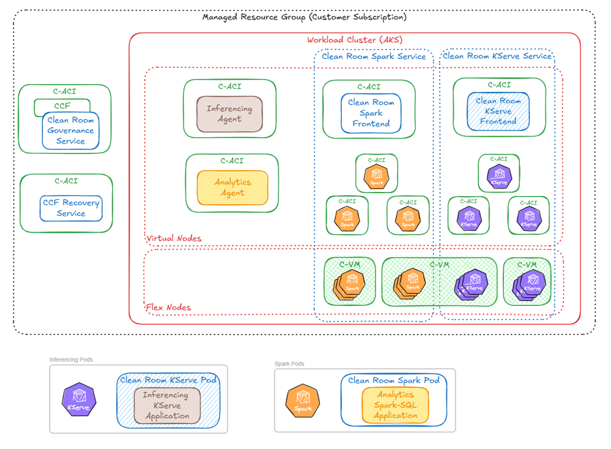
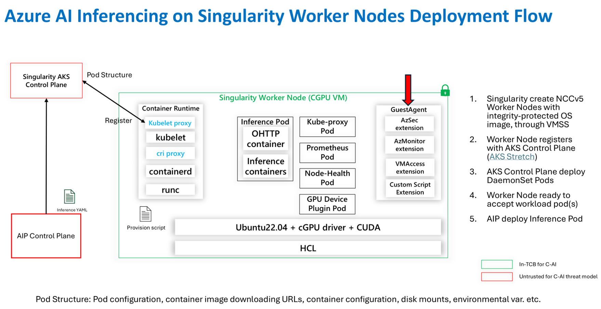
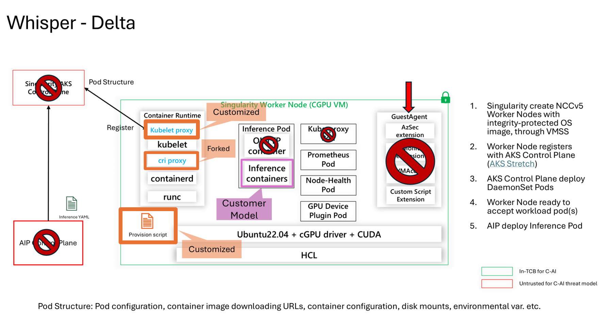
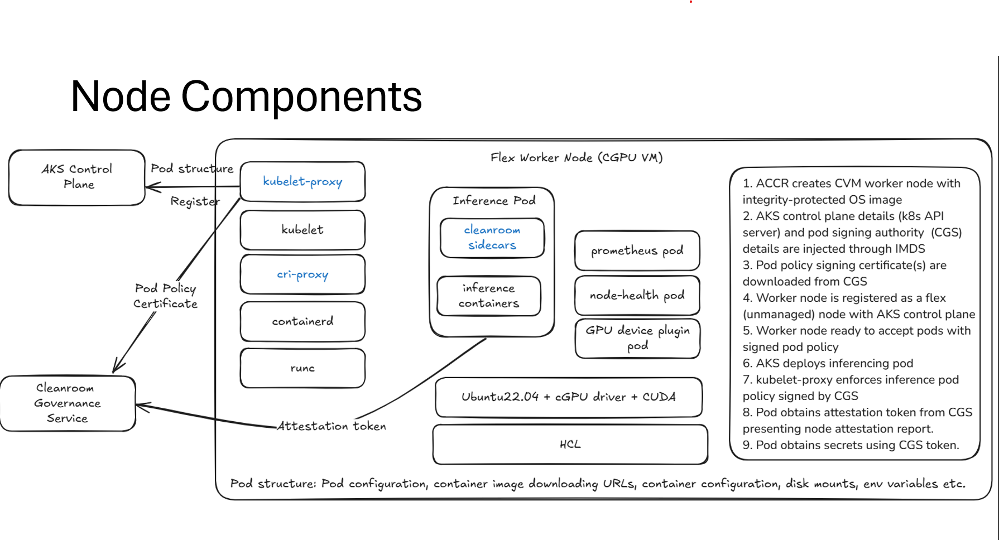
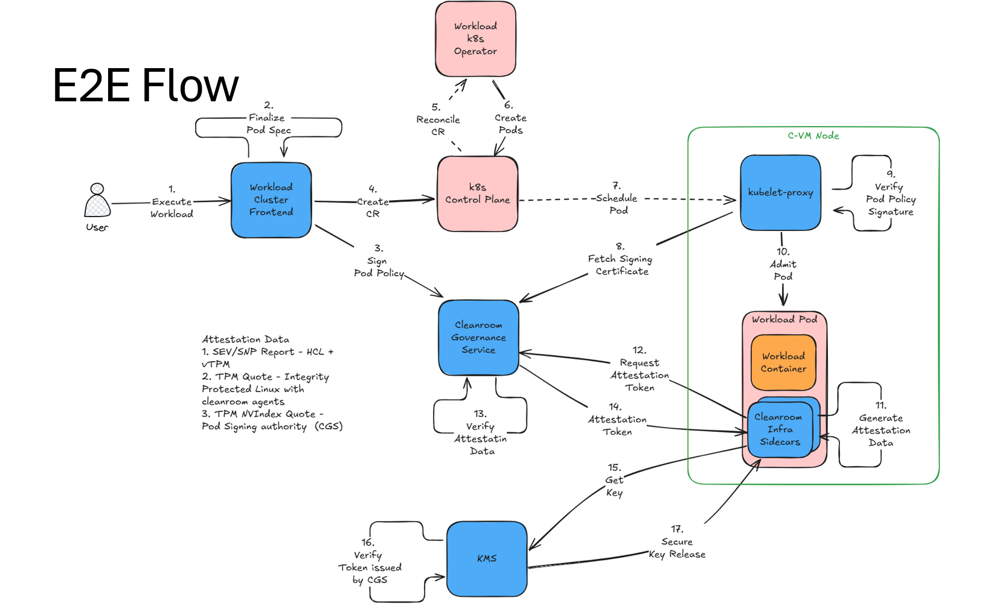

# Confidential Inferencing: End-to-End Guide

- [Confidential Inferencing: End-to-End Guide](#confidential-inferencing-end-to-end-guide)
  - [1. Introduction](#1-introduction)
  - [2. Deployment Topology](#2-deployment-topology)
  - [3. Environment Setup](#3-environment-setup)
    - [3.1 CCF Network Provisioning](#31-ccf-network-provisioning)
    - [3.2 AKS Cluster Creation](#32-aks-cluster-creation)
    - [3.3 Context: Singularity Baseline and Cleanroom Delta](#33-context-singularity-baseline-and-cleanroom-delta)
    - [3.4 Clean Room Governance Service (CGS)](#34-clean-room-governance-service-cgs)
  - [4. Governance and Contracts](#4-governance-and-contracts)
    - [4.1 Contract Lifecycle](#41-contract-lifecycle)
    - [4.2 Certificate Authority](#42-certificate-authority)
    - [4.3 Pod Policy Signing](#43-pod-policy-signing)
    - [4.4 Deployment Template](#44-deployment-template)
  - [5. Flex Worker Node Architecture](#5-flex-worker-node-architecture)
    - [5.1 Node Bootstrap](#51-node-bootstrap)
    - [5.2 kubelet-proxy and cri-proxy](#52-kubelet-proxy-and-cri-proxy)
    - [5.3 Pod Admission and Policy Enforcement](#53-pod-admission-and-policy-enforcement)
  - [6. End-to-End Workload Flow](#6-end-to-end-workload-flow)
    - [6.1 Workload Deployment](#61-workload-deployment)
    - [6.2 Attestation and Key Release](#62-attestation-and-key-release)
  - [7. Inferencing Agent Pod](#7-inferencing-agent-pod)
    - [7.1 Sidecar Architecture](#71-sidecar-architecture)
    - [7.2 Trust Bootstrap](#72-trust-bootstrap)
    - [7.3 Frontend and KServe InferenceService](#73-frontend-and-kserve-inferenceservice)
  - [8. Inference Request Flow](#8-inference-request-flow)
    - [8.1 Request Authorization and Routing](#81-request-authorization-and-routing)
    - [8.2 Supported Protocols](#82-supported-protocols)
  - [9. Cross-Cutting Concerns](#9-cross-cutting-concerns)
    - [9.1 Attestation and Zero-Trust](#91-attestation-and-zero-trust)
    - [9.2 TLS Trust Hierarchy](#92-tls-trust-hierarchy)
    - [9.3 Observability](#93-observability)
  - [10. Component Quick Reference](#10-component-quick-reference)
  - [Appendix: Existing Documentation](#appendix-existing-documentation)

---

## 1. Introduction

Confidential inferencing enables secure, governance-enforced model serving
where multiple organizations can deploy and query AI models without trusting
each other or the cloud operator. It combines AMD SEV-SNP hardware attestation,
the Confidential Consortium Framework (CCF) for ledger-backed governance, and
Kubernetes-based workload orchestration to create a zero-trust inferencing
environment.

**Key actors:**

| Actor                   | Role                                                                                                                         |
| ----------------------- | ---------------------------------------------------------------------------------------------------------------------------- |
| **Model Publisher**     | Publishes models and datasets into the clean room. Defines access policies and retains control over who can query the model. |
| **Collaborator / ISV**  | Queries deployed models via the inferencing endpoint. Must present a valid authorization token for every request.            |
| **Clean Room Operator** | Provisions infrastructure (CCF network, AKS cluster, governance service). In a managed offering, this role is automated.     |

The rest of this document walks through the end-to-end flow - from
provisioning infrastructure through governance setup, workload deployment,
and finally handling inference requests - highlighting what each component
does behind the scenes.

## 2. Deployment Topology



The diagram above shows the overall deployment layout within a customer's
Azure subscription. The key boundaries are:

**Outside the AKS cluster** (standalone C-ACI container groups):
- **CCF + Clean Room Governance Service (CGS)**: The CCF node and CGS
  application run together in a Confidential ACI (C-ACI) container group
  with SNP attestation. This is the governance control plane.
- **CCF Recovery Service**: A separate C-ACI container group that holds
  ledger encryption keys (protected via Secure Key Release) and serves the
  network's attestation report at `/network/report`.

**Inside the Workload Cluster (AKS)**:
- **Virtual Nodes (VN2)**: Host C-ACI-backed pods - the inferencing agent,
  analytics agent, and workload frontends. Each runs as a container group
  with its own SNP attestation boundary.
- **Flex Nodes**: Confidential VMs (C-VM) with GPUs that run the actual
  inference workloads - KServe predictor pods with model weights. These
  nodes have an integrity-protected OS image and a customized container
  runtime (see [§5](#5-flex-worker-node-architecture)).

**Pod types** within the cluster:
- **Clean Room KServe Pod**: Contains the KServe predictor plus cleanroom
  infrastructure sidecars (ccr-proxy, ccr-governance, etc.) for an
  inferencing workload.
- **Clean Room Spark Pod**: Contains the Spark executor plus cleanroom
  sidecars for an analytics workload (not covered in this document).

> **Managed callout:** A managed offering could automate the provisioning
> of all three layers - CCF network, AKS cluster, and CGS - behind a
> single "Create Clean Room" API, hiding the infrastructure complexity
> from the end user.

## 3. Environment Setup

### 3.1 CCF Network Provisioning

A [Confidential Consortium Framework (CCF)](https://github.com/microsoft/ccf)
network is the trust foundation for the entire clean room. It provides a
tamper-proof ledger where all governance decisions (contracts, votes,
secrets, audit events) are recorded.

The provisioning flow:
1. A CCF operator member identity (certificate + private key) is generated.
2. A CCF network is created on C-ACI with one or more CCF nodes running
   in AMD SEV-SNP enclaves.
3. A **Confidential Recovery Service** is deployed alongside the CCF
   network. This service holds the ledger encryption keys (released only
   via hardware attestation) and exposes a `/network/report` endpoint
   that returns the network's SNP attestation report, service certificate,
   constitution digest, and JS application bundle digest.
4. The operator member is enrolled as the initial member of the CCF
   consortium.

The CCF service certificate obtained from the recovery service becomes
the root of trust - all subsequent interactions with the governance
service are authenticated against it.

See [CCF README](/src/ccf/README.md) for details on CCF network creation
and recovery.

### 3.2 AKS Cluster Creation

An AKS workload cluster is provisioned with several capabilities enabled
to support confidential inferencing:

- **VN2 (Virtual Nodes v2)**: Enables scheduling pods as C-ACI container
  groups with SNP attestation. The inferencing agent and frontend run on
  virtual nodes.
- **External DNS**: Provides DNS-based service discovery for the CCF
  endpoint and inferencing agent's public endpoint.
- **CVM Flex Node Pools**: Confidential GPU VMs (NCC v5) that run KServe
  predictor pods. These nodes use an integrity-protected OS image with
  cGPU drivers and CUDA, and register as flex (unmanaged) nodes with
  the AKS control plane (see [§5](#5-flex-worker-node-architecture)).
- **KServe**: The ML model serving framework, deployed in RawDeployment
  mode (not serverless).

The cluster provider configures helm charts for the inferencing agent,
frontend, and associated security policy documents.

See [Cleanroom Cluster README](/src/cleanroom-cluster/README.md) and
[Flex Node Networking](/src/cleanroom-cluster/docs/flexnode-networking.md)
for details.

### 3.3 Context: Singularity Baseline and Cleanroom Delta

To understand what the cleanroom infrastructure adds, it helps to see
what the baseline Azure AI Inferencing platform looks like and where the
cleanroom diverges.

**Baseline - Azure AI Inferencing on Singularity Worker Nodes:**



In the baseline flow, Singularity creates NCC v5 worker nodes (CGPU VMs)
via VMSS. The nodes register with the AKS control plane (AKS Stretch),
DaemonSet pods are deployed, and the AIP control plane deploys inference
pods. The diagram distinguishes what's **in the Trusted Computing Base**
(green) from what's **untrusted** (red) - notably, both the AIP Control
Plane and the Singularity AKS Control Plane are outside the TCB.

**Cleanroom Delta:**



The cleanroom removes or replaces the untrusted components:
- **AIP and Singularity control planes** are removed - workload
  deployment is driven by governance-verified frontends instead.
- **GuestAgent extensions** (AzSec, AzMonitor, VMAccess) are disabled
  to reduce the attack surface on the node.
- **kubelet is forked** to integrate `kubelet-proxy` and `cri-proxy`
  for pod policy enforcement (see [§5.2](#52-kubelet-proxy-and-cri-proxy)).
- **Container runtime and HCL** are customized to support the cleanroom's
  integrity and attestation requirements.
- **Customer models** are injected directly into inference containers
  under governance control rather than through the AIP pipeline.

The net effect is a significantly smaller trust boundary where only
governance-verified code runs on attested hardware.

### 3.4 Clean Room Governance Service (CGS)

The Clean Room Governance Service is a
[CCF JavaScript application](/src/governance/ccf-app/js/) that provides
the governance control plane. It runs inside the CCF network and
exposes APIs for:

- **Contract management** - Create, propose, vote on, and accept
  contracts that define clean room operations.
- **Certificate Authority** - Issue TLS certificates endorsed by the
  clean room's CA, establishing a trusted TLS hierarchy across all pods.
- **Pod policy signing** - Sign pod policies that are enforced at
  admission time on flex worker nodes.
- **Secret store** - Store and release secrets (model credentials,
  encryption keys) only to attested clean room environments.
- **OIDC token issuance** - Issue identity tokens to clean rooms for
  Azure federated credential scenarios.
- **Audit logging** - Record lifecycle events on the CCF ledger for
  tamper-proof auditing.

The CGS sidecar (`ccr-governance`) runs in every clean room pod and
bridges local containers to the remote CGS instance, handling attestation
report generation and HTTPS communication.

See [Governance README](/src/governance/README.md) and
[Governance Samples](/samples/governance/README.md) for details.

> **Managed callout:** A managed layer could abstract CGS deployment
> and member enrollment behind a portal experience - the user would
> simply "create a clean room" and the governance service would be
> provisioned automatically with the creator as the initial member.

## 4. Governance and Contracts

### 4.1 Contract Lifecycle

A contract defines what a clean room is authorized to do. It encodes the
governance endpoint, security parameters, and the set of members who
must approve it. The lifecycle is:

```
  Draft ──► Propose ──► Vote (multi-member) ──► Accept
```

A contract contains:
- **CCF governance endpoint** - The CGS HTTPS URL.
- **SNP host data** - The expected CCE policy hash for the clean room
  containers, binding the contract to specific attested code.
- **Constitution digest and JS app bundle digest** - Integrity hashes
  for the CCF constitution and the CGS application, ensuring governance
  code hasn't been tampered with.
- **Recovery members list** - The set of consortium members who
  participate in CCF network recovery.

All contract state transitions are recorded on the CCF ledger, creating
a tamper-proof audit trail. No workload can be deployed until a contract
is proposed and accepted via multi-member voting.

### 4.2 Certificate Authority

CGS operates as a Certificate Authority for the clean room. The CA
setup involves three governance actions, each requiring a proposal and
multi-member vote:

1. **Propose CA enable** - A member proposes enabling the CA capability
   on the contract.
2. **Vote to accept** - All required members vote to approve.
3. **Generate CA key** - CGS generates a CA key pair and makes the CA
   certificate available.

Once active, the CA cert becomes the **TLS trust root for the entire
clean room**. Every pod's `ccr-proxy` (Envoy) init container obtains
a CGS-endorsed SSL certificate during bootstrap via `generateEndorsedCert`.
Clients connecting to any clean room endpoint can verify the TLS
certificate chain back to this CA.

### 4.3 Pod Policy Signing

CGS signs pod policies that define exactly which containers, command-line
arguments, and environment variables are permitted to run on flex worker
nodes. This is the bridge between governance decisions and runtime
enforcement.

The flow:
1. A **signing key** is proposed, voted on, and generated within CGS -
   similar to the CA key workflow.
2. A **CCE security policy** is created that measures:
   - Container image layers (for every sidecar and workload container)
   - Command-line arguments
   - Environment variable names and values (e.g.,
     `INFERENCING_FRONTEND_SNP_HOST_DATA`,
     `CCF_NETWORK_RECOVERY_MEMBERS`)
3. The security policy is **signed by CGS** using the signing key.
4. The signed policy is attached to the pod specification and verified
   at admission time by `kubelet-proxy` on the flex worker node
   (see [§5.3](#53-pod-admission-and-policy-enforcement)).

This ensures that only governance-approved container configurations can
run on confidential hardware - any tampering with the pod spec would
invalidate the signature.

See the [Security FAQ](/poc/managed-cleanroom/security.md) for details
on what the CCE policy measures for the inferencing agent and frontend.

### 4.4 Deployment Template

Before any workload can be deployed, a deployment template must be
generated, proposed, and voted on. The template is a comprehensive
specification that includes:

- Container images and versions for all sidecars (ccr-proxy,
  ccr-governance, kserve-inferencing-agent, SKR, otel-collector)
- KServe configuration and helm chart references
- Security policy documents (the signed CCE policies from §4.3)
- Infrastructure type (virtual or AKS)
- Contract ID binding

The template is proposed to CGS and must be voted on by the required
members. Once accepted, the workload cluster frontend can use it to
deploy inferencing pods. Any attempt to deploy a configuration that
doesn't match the accepted template is rejected.

> **Managed callout:** In a managed offering, deployment template
> generation, signing, and voting could be automated - the user would
> choose a model and configuration, and the system would handle the
> governance workflow transparently.

## 5. Flex Worker Node Architecture



Flex worker nodes are Confidential VMs (CGPU VMs) that provide the
GPU compute for model inference. Unlike standard AKS nodes, they use
a customized software stack with additional security controls.

### 5.1 Node Bootstrap

A flex worker node goes through a multi-step bootstrap process before
it can accept workloads:

1. **ACCR creates a CVM worker node** with an integrity-protected OS
   image (Ubuntu 22.04 + cGPU driver + CUDA). The Hardware Compatibility
   Layer (HCL) provides the AMD SEV-SNP attestation foundation.
2. **AKS control plane details and pod signing authority (CGS) details
   are injected through IMDS** - the node learns where to register and
   which governance service to trust.
3. **Pod policy signing certificate(s) are downloaded from CGS** - these
   certificates will be used to verify pod policy signatures at admission
   time.
4. **The worker node registers as a flex (unmanaged) node** with the AKS
   control plane.
5. **The worker node is ready to accept pods** - but only pods whose
   policies are signed by CGS.

System-level pods (Prometheus, node-health, GPU device plugin) are
deployed as DaemonSets once the node registers with the control plane.

### 5.2 kubelet-proxy and cri-proxy

Two interception layers sit between the AKS control plane and the
container runtime:

- **kubelet-proxy** intercepts pod admission requests from the AKS
  control plane before they reach kubelet. Its primary responsibility is
  to **verify pod policy signatures** - it fetches the signing certificate
  from CGS and validates that each pod's policy was signed by CGS before
  allowing it to proceed. This is the enforcement point for the governance
  decisions made in [§4.3](#43-pod-policy-signing).

- **cri-proxy** sits between kubelet and containerd, intercepting
  container runtime calls. This provides an additional enforcement layer
  at the container runtime level.

Both proxies are part of the customized container runtime stack
(see the "forked kubelet" in the [Whisper delta diagram](#33-context-singularity-baseline-and-cleanroom-delta)).

### 5.3 Pod Admission and Policy Enforcement

When a pod is scheduled to a flex node, the admission flow is:

1. The AKS control plane sends the pod specification to the node.
2. **kubelet-proxy** intercepts the request and extracts the pod's
   attached security policy.
3. kubelet-proxy **fetches the signing certificate from CGS** (or uses
   a cached copy).
4. kubelet-proxy **verifies the pod policy signature** against the
   CGS signing certificate.
5. If the signature is valid, the pod is **admitted** and passed to
   kubelet → containerd → runc for execution.
6. If the signature is invalid or missing, the pod is **rejected**.

This ensures that no unauthorized container configuration - modified
images, altered CLI arguments, unexpected environment variables - can
run on the confidential hardware. The policy was defined in governance
(§4.3), signed by CGS, and is now enforced at the node level without
trusting the AKS control plane.

## 6. End-to-End Workload Flow



The diagram above shows the complete workload execution flow from
a user initiating deployment through to the workload pod obtaining
secrets via Secure Key Release.

### 6.1 Workload Deployment

| Step | Action                                                                                                                                        |
| ---- | --------------------------------------------------------------------------------------------------------------------------------------------- |
| 1    | User initiates workload execution via the **Workload Cluster Frontend**.                                                                      |
| 2    | Frontend **finalizes the Pod Spec** in coordination with the Workload k8s Operator.                                                           |
| 3    | Frontend requests CGS to **sign the pod policy**. CGS signs it with the governance signing key established in [§4.3](#43-pod-policy-signing). |
| 4    | Frontend **creates a Custom Resource** (CR) in the k8s Control Plane.                                                                         |
| 5    | The **Workload k8s Operator reconciles** the CR.                                                                                              |
| 6    | The Operator **creates the Pod** resources.                                                                                                   |
| 7    | The k8s Control Plane **schedules the pod** to a flex worker node, where kubelet-proxy receives it.                                           |
| 8    | kubelet-proxy **fetches the signing certificate** from CGS.                                                                                   |
| 9    | kubelet-proxy **verifies the pod policy signature**.                                                                                          |
| 10   | Pod is **admitted** and starts running on the confidential VM.                                                                                |

### 6.2 Attestation and Key Release

Once the pod is admitted and running, the cleanroom infrastructure
sidecars establish their identity and obtain secrets:

| Step | Action                                                                                                                                                                                      |
| ---- | ------------------------------------------------------------------------------------------------------------------------------------------------------------------------------------------- |
| 11   | Cleanroom infrastructure sidecars **generate attestation data** from the node's hardware.                                                                                                   |
| 12   | Sidecars **request an attestation token** from CGS, presenting the node attestation report.                                                                                                 |
| 13   | CGS **verifies three types of attestation data**:                                                                                                                                           |
|      | **(a)** SEV/SNP Report (HCL + vTPM) - proves the code is running on genuine AMD SEV-SNP hardware.                                                                                           |
|      | **(b)** TPM Quote (integrity-protected Linux) - proves the OS and cleanroom agents haven't been tampered with.                                                                              |
|      | **(c)** TPM NVIndex Quote (pod signing authority = CGS) - proves the node trusts CGS as its pod signing authority.                                                                          |
| 14   | CGS **issues an attestation token** to the sidecars.                                                                                                                                        |
| 15   | CGS **requests a key from KMS** on behalf of the workload.                                                                                                                                  |
| 16   | KMS **verifies the token was issued by CGS** (trusted issuer check).                                                                                                                        |
| 17   | KMS performs **Secure Key Release** - the encryption key is released to the cleanroom infrastructure sidecars, enabling the workload to decrypt model weights, access secrets, and operate. |

## 7. Inferencing Agent Pod

### 7.1 Sidecar Architecture

The inferencing agent runs as a C-ACI container group on a virtual node.
It contains multiple containers, each with a distinct role:

```
┌─────────────────────────────────────────────────────┐
│             Inferencing Agent Pod                    │
│                                                     │
│  ┌───────────────────────────────────────────────┐  │
│  │  ccr-proxy (Envoy) :443                       │  │
│  │  TLS termination, routing, ext_authz          │  │
│  └───────────────────────────────────────────────┘  │
│                                                     │
│  ┌──────────────────┐  ┌──────────────────┐         │
│  │ inferencing-agent│  │ ccr-governance   │         │
│  │ :8080            │  │ :8300            │         │
│  │ Control plane,   │  │ Bridge to CGS,   │         │
│  │ authz, model     │  │ trust bootstrap, │         │
│  │ deployment       │  │ consent, secrets │         │
│  └──────────────────┘  └──────────────────┘         │
│                                                     │
│  ┌──────────────────┐  ┌──────────────────┐         │
│  │ skr              │  │ otel-collector   │         │
│  │ :8284            │  │                  │         │
│  │ AMD SNP          │  │ Telemetry        │         │
│  │ attestation      │  │ collection       │         │
│  └──────────────────┘  └──────────────────┘         │
└─────────────────────────────────────────────────────┘
```

| Sidecar                      | Purpose                                                                                                                                                                                                          |
| ---------------------------- | ---------------------------------------------------------------------------------------------------------------------------------------------------------------------------------------------------------------- |
| **ccr-proxy** (Envoy)        | Terminates incoming HTTPS on port 443 using a CGS CA-endorsed certificate. Routes requests by path: `/ai/*` to predictor pods (via ext_authz + dynamic forward proxy), all other paths to the inferencing agent. |
| **kserve-inferencing-agent** | Control plane for model deployment. Handles `/inferenceServices` APIs, validates authorization tokens against CGS, coordinates with the frontend to create KServe InferenceService resources.                    |
| **ccr-governance**           | Bridges the pod to the remote CGS instance. Handles trust bootstrap (fetching CCF service cert), attestation report generation, consent checks, secret retrieval, and audit event logging.                       |
| **skr**                      | AMD SEV-SNP attestation endpoint. Provides hardware attestation reports via `localhost:8284` for generating platform evidence.                                                                                   |
| **otel-collector**           | Collects OTLP telemetry (logs, traces, metrics) from all sidecars and forwards to configured backends, subject to governance consent.                                                                            |

### 7.2 Trust Bootstrap

Before the inferencing agent can serve any requests, the `ccr-governance`
sidecar must establish trust with the CCF network. This happens at pod
startup:

```
ccr-governance sidecar
  │
  ├─ GET <recovery-agent>/network/report
  │    Returns: SNP report + payload (serviceCert, constitutionDigest,
  │             jsappBundleDigest)
  │
  ├─ Verify SNP attestation:
  │    ├─ hostData == expected CCE policy hash
  │    └─ reportData == SHA256(payload)
  │
  ├─ Verify constitutionDigest and jsappBundleDigest match
  │   configured expected values
  │
  ├─ Verify consortium membership matches expected recovery members
  │   (from CCF_NETWORK_RECOVERY_MEMBERS env var)
  │
  └─ Extract serviceCert → use as trusted CA for all CGS HTTPS calls
```

This flow ensures that the pod only trusts a CCF network that is:
- Running the expected code (hostData matches CCE policy hash)
- Serving the expected governance application (JS app bundle digest)
- Governed by the expected constitution (constitution digest)
- Operated by the expected consortium (recovery members list)

If any verification fails, the sidecar refuses to start and the pod
cannot serve requests. See
[call-chains.md](/src/workloads/inferencing/kserve-inferencing-agent/docs/call-chains.md)
for the full call chain details.

### 7.3 Frontend and KServe InferenceService

The **kserve-inferencing-frontend** runs as a separate pod (also on a
virtual node) and is responsible for submitting KServe `InferenceService`
custom resources to Kubernetes.

When the inferencing agent receives a model deployment request:

1. **Token validation** - The agent validates the caller's
   `x-ms-cleanroom-authorization` bearer token against CGS, confirming
   the caller is an active consortium member.
2. **Frontend trust establishment** - The agent connects to the
   frontend's `/report` endpoint and verifies its SNP attestation report.
   It checks that `hostData` matches the expected frontend CCE policy
   hash (configured via `INFERENCING_FRONTEND_SNP_HOST_DATA` env var).
   The frontend returns its self-signed service certificate, and the agent
   verifies `reportData` matches the cert hash.
3. **Model document retrieval** - The agent fetches the model
   configuration from CGS.
4. **InferenceService creation** - The agent submits the deployment
   request to the frontend, which creates a KServe `InferenceService` CR.
   KServe's controller creates the predictor pod with the model's serving
   runtime.
5. **Storage mounting** - Predictor pods mount encrypted model weights
   from cloud storage via `blobfuse-launcher`. The launcher retrieves
   storage credentials through the identity service using the CGS
   attestation token.

## 8. Inference Request Flow

### 8.1 Request Authorization and Routing

Once a model is deployed, inference requests follow a per-request
authorization and routing flow through the Envoy proxy:

```
ISV / Application
  │
  │  POST https://<cleanroom-endpoint>/ai/openai/v1/chat/completions
  │  Header: x-ms-cleanroom-authorization: Bearer <token>
  ▼
ccr-proxy (Envoy, port 443)
  │
  ├─ ext_authz filter
  │    └─ POST agent /authz/{path}
  │         ├─ Validate token → ccr-governance → CGS
  │         │   (response cached for 15 minutes)
  │         └─ Return headers:
  │              x-model-name: <model>
  │              x-model-endpoint: <predictor-fqdn>
  │
  ├─ Lua filter
  │    └─ Rewrite Host header to predictor service FQDN
  │       (e.g., hello-iris-predictor.kserve-inferencing.svc.cluster.local)
  │
  ├─ Dynamic forward proxy
  │    ├─ Resolve predictor DNS
  │    └─ Establish HTTPS connection to predictor,
  │       verifying TLS cert against CGS CA cert
  │
  └─ Predictor Pod :443
       └─ Run inference → return response to caller
```

Key aspects of this flow:
- **Per-request authorization**: Every inference request is validated
  against CGS. The ext_authz filter calls the agent's `/authz` endpoint
  which delegates to CGS via the ccr-governance sidecar. Results are
  cached for 15 minutes.
- **Dynamic routing**: The model name and endpoint are returned as
  response headers from ext_authz. A Lua filter rewrites the Host header,
  and Envoy's dynamic forward proxy resolves the predictor's DNS and
  routes the request.
- **End-to-end TLS**: The predictor pod also runs a `ccr-proxy` sidecar
  with a CGS CA-endorsed certificate. The agent's Envoy validates the
  predictor's TLS cert against the CGS CA, ensuring the connection
  terminates inside an attested environment.

See [Inferencing Agent README](/src/workloads/inferencing/kserve-inferencing-agent/README.md)
for the full route handling details and
[call-chains.md](/src/workloads/inferencing/kserve-inferencing-agent/docs/call-chains.md)
for the complete call chain.

### 8.2 Supported Protocols

The inferencing agent supports three protocol families, determined by
the URL path pattern on the `/ai/*` route:

| Protocol                         | Path Pattern                     | Streaming             | Use Case                               |
| -------------------------------- | -------------------------------- | --------------------- | -------------------------------------- |
| **V1** (TensorFlow Serving)      | `/ai/v1/models/<name>:predict`   | No (request-response) | Classical ML models (sklearn, XGBoost) |
| **V2** (Open Inference Protocol) | `/ai/v2/models/<name>/infer`     | No (request-response) | Standardized tensor-based inference    |
| **OpenAI-compatible**            | `/ai/openai/v1/chat/completions` | Yes (SSE)             | LLM chat/completions, embeddings       |

OpenAI-compatible endpoints support **Server-Sent Events (SSE)** for
token-by-token streaming when `"stream": true` is set in the request
body. V1 and V2 protocols are strictly request-response.

## 9. Cross-Cutting Concerns

### 9.1 Attestation and Zero-Trust

The clean room uses three types of attestation data to establish trust,
each proving a different layer of the stack:

| Attestation Type                              | What It Proves                                                                                    |
| --------------------------------------------- | ------------------------------------------------------------------------------------------------- |
| **SEV/SNP Report** (HCL + vTPM)               | The code is running on genuine AMD SEV-SNP hardware with the expected firmware.                   |
| **TPM Quote** (integrity-protected Linux)     | The OS image and cleanroom agents haven't been tampered with since boot.                          |
| **TPM NVIndex Quote** (pod signing authority) | The node trusts CGS as its pod signing authority - connecting hardware attestation to governance. |

The trust chain flows from hardware up through governance:

```
AMD Hardware ──► SEV-SNP TEE ──► CCF Ledger ──► CGS ──► Pod
```

At each layer, the component above can only operate if the layer below
provides valid attestation. The CCE policy hash in `hostData` binds
container code integrity to the hardware attestation, ensuring that
even a compromised AKS control plane cannot inject unauthorized code.

See the [Security FAQ](/poc/managed-cleanroom/security.md) for detailed
trust establishment Q&A for the inferencing environment.

### 9.2 TLS Trust Hierarchy

All pod-to-pod communication within the clean room uses TLS certificates
endorsed by the CGS Certificate Authority:

```
Client (ISV)
  │
  │  HTTPS (verify against CGS CA cert)
  ▼
Inferencing Agent (ccr-proxy :443)
  │  CGS CA-endorsed cert obtained during bootstrap
  │
  │  HTTPS (verify predictor cert against CGS CA)
  ▼
Predictor Pod (ccr-proxy :443)
     CGS CA-endorsed cert obtained during bootstrap
```

During pod startup, the `ccr-proxy` init container calls
`generateEndorsedCert` on the ccr-governance sidecar, which requests a
CGS-endorsed TLS certificate. This certificate is bound to the pod's
attested identity - verifying the TLS cert chain confirms that the
connection terminates inside a governance-approved, hardware-attested
clean room environment.

External clients can retrieve the CGS CA certificate to verify
connections to any clean room endpoint.

### 9.3 Observability

Telemetry collection is governance-controlled:

- An **otel-collector** sidecar runs in each pod, collecting OTLP-format
  logs, traces, and metrics from all containers.
- Before forwarding telemetry data, the ccr-governance sidecar checks
  **telemetry consent** status with CGS. Telemetry export is only enabled
  if the governance contract has been configured to allow it and the
  required members have voted to consent.
- Telemetry data flows through the otel-collector to configured backends
  (e.g., Azure Monitor, Grafana).

This ensures that sensitive operational data from the clean room is
only exported when all parties have explicitly agreed.

## 10. Component Quick Reference

| Component                       | Purpose                                                                                                                                       |
| ------------------------------- | --------------------------------------------------------------------------------------------------------------------------------------------- |
| **CCF**                         | Confidential Consortium Framework - ledger-backed governance consensus.                                                                       |
| **CGS**                         | Clean Room Governance Service - CCF JS application managing contracts, CA, pod signing, secrets, OIDC, and audit.                             |
| **CCF Recovery Service**        | Holds ledger encryption keys via SKR; serves `/network/report` for trust bootstrap.                                                           |
| **ccr-proxy** (Envoy)           | TLS termination with CGS CA cert, ext_authz authorization, Lua header rewriting, dynamic forward proxy to predictors.                         |
| **ccr-governance**              | Sidecar in every pod - bridges containers to CGS; handles trust bootstrap, consent checks, secret retrieval, audit events.                    |
| **kserve-inferencing-agent**    | Control plane: model deployment authorization, frontend trust, governance coordination.                                                       |
| **kserve-inferencing-frontend** | Creates KServe InferenceService CRs; manages predictor pod lifecycle.                                                                         |
| **kubelet-proxy**               | Pod admission gatekeeper on flex nodes - verifies CGS-signed pod policies before admitting pods.                                              |
| **cri-proxy**                   | Container runtime interception layer between kubelet and containerd for policy enforcement.                                                   |
| **SKR**                         | Secure Key Release - AMD SNP attestation endpoint at `:8284`; provides hardware attestation reports.                                          |
| **blobfuse-launcher**           | Mounts encrypted cloud storage (Azure Blob) into pod filesystem for model weight access.                                                      |
| **Proxy ext-processor**         | Go gRPC sidecar implementing Envoy's External Processing filter with OPA policy evaluation. See [README](/src/proxy-ext-processor/README.md). |

## Appendix: Existing Documentation

| Topic                       | Document                                                                               | Description                                                    |
| --------------------------- | -------------------------------------------------------------------------------------- | -------------------------------------------------------------- |
| **CCF**                     | [CCF README](/src/ccf/README.md)                                                       | CCF network creation, CACI and virtual environments, recovery  |
| **Governance**              | [Governance README](/src/governance/README.md)                                         | CGS architecture, components (ccf-app, client, sidecar, UI)    |
| **Governance Samples**      | [Samples README](/samples/governance/README.md)                                        | CLI commands for contract, policy, secrets, OIDC, consent      |
| **Governance Sidecar**      | [Sidecar README](/src/governance/sidecar/README.md)                                    | ccr-governance HTTP API: events, secrets, consent, tokens      |
| **Inferencing Agent**       | [Agent README](/src/workloads/inferencing/kserve-inferencing-agent/README.md)          | Pod architecture, route handling, Envoy configuration          |
| **Inferencing Call Chains** | [Call Chains](/src/workloads/inferencing/kserve-inferencing-agent/docs/call-chains.md) | Trust bootstrap, model deployment, and inference request flows |
| **Proxy Ext-Processor**     | [Ext-Processor README](/src/proxy-ext-processor/README.md)                             | Envoy external processor sidecar, OPA policy engine            |
| **Cleanroom Cluster**       | [Cluster README](/src/cleanroom-cluster/README.md)                                     | AKS cluster provisioning, flex nodes, VN2                      |
| **Flex Node Networking**    | [Networking](/src/cleanroom-cluster/docs/flexnode-networking.md)                       | Shared-subnet flex nodes, pod IP allocation                    |
| **Security FAQ**            | [Security](/poc/managed-cleanroom/security.md)                                         | Trust establishment, CCE policies, authorization, attestation  |
| **Managed Clean Room**      | [Overview](/poc/managed-cleanroom/README.md)                                           | Managed clean room architecture, component views               |
| **Initial Setup Flows**     | [Setup](/poc/managed-cleanroom/intial-setup.md)                                        | Sequence diagrams for clean room and workload creation         |
