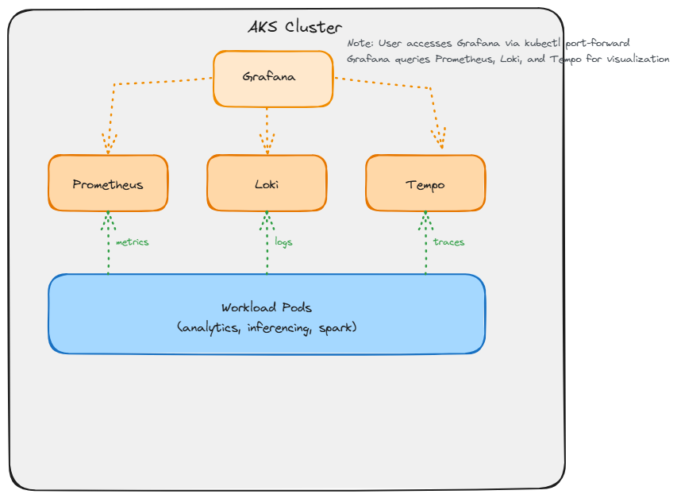
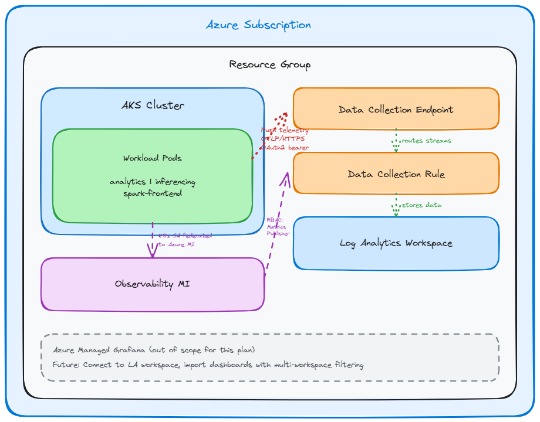

# Azure Monitor Integration for Cleanroom Cluster Observability

## Problem Statement

Currently, cleanroom clusters deploy a full observability stack within the Kubernetes cluster using Helm charts:
- **Prometheus** for metrics collection
- **Loki** for log aggregation  
- **Tempo** for distributed tracing
- **Grafana** for visualization

This approach has limitations:
- Consumes cluster resources (CPU, memory, storage) for the observability infrastructure itself
- Telemetry data is ephemeral and tied to cluster lifecycle
- Scaling and high availability require additional configuration
- No centralized view across multiple clusters

**Solution**: Integrate with Azure Monitor to offload observability infrastructure to a managed service. Workload pods will push OpenTelemetry data directly to Azure Monitor via Data Collection Endpoints, eliminating the need for in-cluster collection services.

## Architecture

### Current State (Local Observability)



**Overview**: Observability stack runs entirely within the AKS cluster. Workload pods send OTel data to in-cluster Prometheus (metrics), Loki (logs), and Tempo (traces). Users access Grafana via kubectl port-forward for visualization.

**Limitations**:
- Consumes cluster resources (CPU, memory, storage)
- Data lifecycle tied to cluster
- No centralized view across multiple clusters
- Scaling and HA require additional configuration

### Target State (Azure Monitor Integration)



**Overview**: Observability infrastructure moves to Azure managed services. Workload pods push OTel data directly to Azure Monitor via Data Collection Endpoints. Log Analytics workspace provides durable storage and query capabilities.

**Key Components**:
1. **Workload Pods**: Run OTel collector sidecars using `azure-monitor-otel` service account
2. **Data Collection Endpoint (DCE)**: Public HTTPS ingestion endpoint for telemetry
3. **Data Collection Rule (DCR)**: Routes metrics, logs, traces to appropriate streams in Log Analytics
4. **Log Analytics Workspace**: Central storage with custom tables and KQL query interface
5. **Observability Managed Identity**: Authenticates pods to DCE via workload identity federation

**Visualization** (separate plan):
- See [Azure Managed Grafana Integration](grafana-plan.md) for cross-tenant visualization architecture
- Grafana instance connects to LA workspace for querying telemetry data

**Authentication Flow**:
- Pods use K8s service account `azure-monitor-otel`
- Workload identity federates K8s SA to Azure managed identity
- MI has "Monitoring Metrics Publisher" role on DCR
- Pods authenticate to DCE using MI credentials

## Implementation Plan

> **Detailed implementation with code references**: See [detailed-implementation.md](files/detailed-implementation.md)

### 1. Azure Monitor Resource Creation

This phase creates the Azure Monitor infrastructure that will receive and store telemetry data from workload pods.

#### Log Analytics Workspace
**Purpose**: Central repository for all telemetry data (metrics, logs, traces)

**Configuration**:
- **Location**: Same Azure region as the AKS cluster
- **Resource Group**: Same resource group as the AKS cluster (`providerConfig.resourceGroupName`)
- **Naming**: `{aksClusterName}-la-workspace`
- **Retention**: Default retention policies apply (31 days basic logs, 90 days analytics logs)
- **Lifecycle**: Tagged with cluster name for discovery; **preserved on cluster deletion** for audit/compliance

**Key Features**:
- Custom tables for Prometheus metrics, logs, and traces
- KQL (Kusto Query Language) for querying telemetry
- Long-term storage independent of cluster lifecycle
- Foundation for visualization (via Managed Grafana) and alerting

#### Data Collection Endpoint (DCE)
**Purpose**: Public HTTPS endpoint that receives telemetry pushes from workload pods

**Configuration**:
- **Location**: Same as AKS cluster and LA workspace
- **Resource Group**: Same as AKS cluster
- **Naming**: `{aksClusterName}-dce`
- **Network Access**: Public (pods push from within AKS cluster over internet)
- **Lifecycle**: Tagged with cluster name; **deleted on cluster deletion**

**Key Features**:
- Ingestion endpoint URL for OTel collectors to connect to
- Authentication via Azure managed identity (workload identity)
- Routes incoming telemetry to Data Collection Rule for processing

#### Data Collection Rule (DCR)
**Purpose**: Defines how incoming telemetry is processed and routed to Log Analytics workspace

**Configuration**:
- **Location**: Same as AKS cluster
- **Resource Group**: Same as AKS cluster
- **Naming**: `{aksClusterName}-dcr`
- **Data Flows**: Three streams configured:
  - **Prometheus metrics** → `Microsoft-PrometheusMetrics` stream → Custom metrics table
  - **OTLP logs** → `Custom-LogData` stream → Custom logs table  
  - **OTLP traces** → `Microsoft-Trace` stream → Custom traces table
- **Linked Resources**: References both the DCE and LA workspace
- **Lifecycle**: Tagged with cluster name; **deleted on cluster deletion**

**Key Features**:
- Provides immutableId used in telemetry ingestion URLs
- RBAC scope for granting telemetry push permissions
- Transformation rules (if needed) for data normalization

#### Resource Creation Flow
1. Create Log Analytics workspace
2. Create Data Collection Endpoint
3. Create Data Collection Rule (links DCE → LA workspace)
4. Tag all resources with cluster name for lifecycle management

### 2. Connecting Workload Pods to Azure Monitor

This phase establishes the authentication and configuration needed for workload pods to push telemetry to Azure Monitor.

#### Observability Managed Identity
**Purpose**: Azure identity that workload pods assume to authenticate when pushing telemetry

**Configuration**:
- **Resource Group**: Same as AKS cluster
- **Naming**: `{clusterName}-observability-identity`
- **Type**: User-assigned managed identity
- **Lifecycle**: Tagged with cluster name; **deleted on cluster deletion**

**Key Features**:
- Single shared identity for all OTel collector sidecars across all workload types
- Federated credentials link this Azure identity to Kubernetes service accounts
- Granted "Monitoring Metrics Publisher" role on the DCR (enables telemetry push)

#### Workload Identity Federation Setup
**Purpose**: Allows Kubernetes pods to authenticate as the Azure managed identity without credentials

**Configuration**:
- **Federated Credential Subject**: `system:serviceaccount:{namespace}:azure-monitor-otel`
- **Issuer**: AKS cluster OIDC issuer URL (from `aks.Data.OidcIssuerProfile.IssuerUriInfo`)
- **Audience**: `api://AzureADTokenExchange` (default for workload identity)
- **Namespaces**: Applied to all workload namespaces:
  - `cleanroom-analytics-agent`
  - `cleanroom-inferencing-agent`
  - `cleanroom-spark-frontend`
  - Any other workload namespaces

**How It Works**:
1. Kubernetes service account `azure-monitor-otel` is created in each workload namespace
2. Federated credential establishes trust: "Any pod using this K8s SA can get tokens for this Azure MI"
3. Pods use projected service account token to request Azure AD tokens
4. Azure AD validates the Kubernetes token against the OIDC issuer and issues Azure tokens
5. Pods use Azure tokens to authenticate to the DCE endpoint

#### RBAC Configuration
**Purpose**: Grant the observability MI permission to push telemetry to Azure Monitor

**Configuration**:
- **Role**: "Monitoring Metrics Publisher" (Azure built-in role)
- **Role ID**: `3913510d-42f4-4e42-8a64-420c390055eb`
- **Scope**: The Data Collection Rule (DCR) resource
- **Principal**: Observability managed identity

**Permissions Granted**:
- Push metrics to DCE endpoints
- Push logs to DCE endpoints
- Push traces to DCE endpoints
- All pushes must target the specific DCR (scoped access)

#### OTel Collector Configuration
**Purpose**: Configure the OpenTelemetry collector sidecar to authenticate to Azure and push to DCE endpoints

**Exporter Strategy Decision**:
We use standard **OTLP HTTP exporters with OAuth2 authentication** rather than Azure-specific exporters because:
- The `azuremonitorexporter` targets Application Insights (APM), not Log Analytics via DCE/DCR
- OTLP HTTP is the standard protocol for DCE ingestion
- OAuth2 client extension provides native workload identity support
- No additional Azure-specific dependencies needed

**Configuration Changes to `otel-config.yaml.j2` Template**:

1. **OAuth2 Client Extension** (for Azure AD authentication):
   ```yaml
   extensions:
     oauth2client:
       token_url: https://login.microsoftonline.com/{{ azure_tenant_id }}/oauth2/v2.0/token
       client_id: {{ observability_mi_client_id }}
       # Workload identity automatically provides federated token file
       token_file: /var/run/secrets/azure/tokens/azure-identity-token
       scopes:
         - https://monitor.azure.com/.default
   ```

2. **OTLP HTTP Exporters** (three separate exporters for three DCE streams):
   ```yaml
   exporters:
     otlphttp/azuremonitor-metrics:
       endpoint: {{ dce_endpoint }}/dataCollectionRules/{{ dcr_immutable_id }}/streams/Microsoft-PrometheusMetrics
       auth:
         authenticator: oauth2client
     
     otlphttp/azuremonitor-logs:
       endpoint: {{ dce_endpoint }}/dataCollectionRules/{{ dcr_immutable_id }}/streams/Custom-LogData
       auth:
         authenticator: oauth2client
     
     otlphttp/azuremonitor-traces:
       endpoint: {{ dce_endpoint }}/dataCollectionRules/{{ dcr_immutable_id }}/streams/Microsoft-Trace
       auth:
         authenticator: oauth2client
   ```

3. **Service Pipelines** (route to Azure Monitor exporters):
   ```yaml
   service:
     extensions: [oauth2client]
     pipelines:
       metrics:
         receivers: [otlp, apachespark, prometheus]
         processors: [batch, resource, transform/resource_labels, transform/spark]
         exporters: [otlphttp/azuremonitor-metrics]
       
       logs:
         receivers: [otlp]
         processors: [batch]
         exporters: [otlphttp/azuremonitor-logs]
       
       traces:
         receivers: [otlp]
         processors: [batch]
         exporters: [otlphttp/azuremonitor-traces]
   ```

4. **Environment Variables** (set in pod spec):
   - `AZURE_CLIENT_ID`: Observability MI client ID
   - `AZURE_TENANT_ID`: Azure tenant ID
   - `AZURE_FEDERATED_TOKEN_FILE`: `/var/run/secrets/azure/tokens/azure-identity-token` (injected by K8s)

**Helm Values Template Changes**:
Add service account annotation to `values.app.yaml` for all workload types:
```yaml
serviceAccount:
  annotations:
    azure.workload.identity/client-id: <OBSERVABILITY_MI_CLIENT_ID>
```

**Conditional Logic**:
The template rendering must conditionally include Azure Monitor configuration only when `useAzureMonitor: true`:
- Local mode: Use existing `prometheusremotewrite`, `otlphttp/logs`, `otlp/tempo` exporters
- Azure Monitor mode: Use `oauth2client` extension and `otlphttp/azuremonitor-*` exporters

#### Connection Flow
1. **Pod Startup**: Pod starts with `azure-monitor-otel` service account (annotated with MI client ID)
2. **Token Projection**: Kubernetes injects federated service account token at `/var/run/secrets/azure/tokens/azure-identity-token`
3. **OTel Collector Initialization**: Collector loads config with `oauth2client` extension
4. **Token Exchange**: OAuth2 client extension reads federated token and exchanges it for Azure AD bearer token from `login.microsoftonline.com`
5. **Telemetry Push**: OTel collector pushes metrics/logs/traces to DCE endpoint URLs with `Authorization: Bearer <token>` header
6. **DCE Validation**: DCE validates Azure AD token and checks MI has proper role on DCR
7. **DCR Routing**: DCR routes telemetry to appropriate streams in Log Analytics workspace
8. **Storage**: Telemetry appears in LA workspace custom tables, ready for querying

**Key Insight**: The OAuth2 client extension in the OTel collector handles the entire Azure AD authentication flow automatically using workload identity - no manual token management required.
5. **Ingestion**: DCE validates token, routes data via DCR to Log Analytics workspace
6. **Storage**: Telemetry appears in LA workspace custom tables, ready for querying

### 3. CLI and User Interface
Users enable Azure Monitor mode via command-line flags:

```bash
# Azure CLI
az cleanroom cluster create --enable-observability --use-azure-monitor ...

# PowerShell
./deploy-cluster.ps1 -enableObservability -useAzureMonitor
```

When `--use-azure-monitor` is specified:
- Prometheus/Loki/Tempo/Grafana Helm charts are **NOT** installed
- Azure Monitor resources (LA workspace, DCE, DCR, MI) **ARE** created
- Workload pods configured with Azure endpoints instead of local services


## Out of Scope (Future Work)

### Azure Managed Grafana Integration
The following topics will be addressed in a separate planning document:
1. Provisioning Managed Grafana instance
2. Connecting Grafana to Log Analytics workspace
3. Migrating existing dashboards
4. Multi-workspace filtering for multi-cluster observability
5. RBAC and access control configuration
