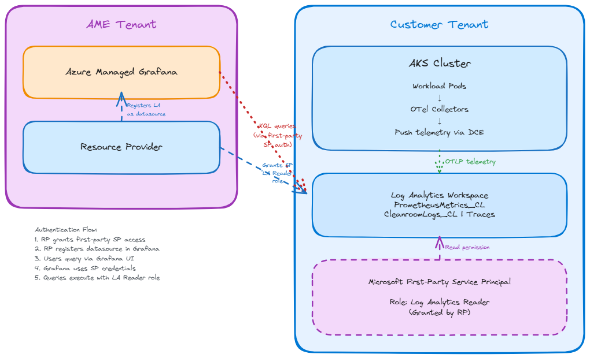

# Azure Managed Grafana Integration for Cleanroom Observability

## Problem Statement

The cleanroom cluster observability system stores telemetry data in customer Log Analytics workspaces via Azure Monitor integration. However, visualization of this data requires:
- A Grafana instance that can query data across multiple customer tenants
- Cross-tenant authentication to access customer LA workspaces
- Dashboard templates converted from local observability tools (Prometheus/Loki/Tempo)
- Multi-workspace filtering to support multiple customers

**Current Gap**: No visualization layer exists for Azure Monitor-based observability.

**Solution**: Integrate with Azure Managed Grafana (hosted in Microsoft AME tenant) using a first-party service principal for cross-tenant authentication. The Resource Provider automatically configures data source connections, and dashboards use KQL to query Log Analytics tables.

## Architecture

### Cross-Tenant Overview

The architecture spans two Azure tenants:

**AME Tenant (Microsoft-Managed)**
- Azure Managed Grafana instance (pre-provisioned)
- Resource Provider service
- First-party service principal (shared across customers)

**Customer Tenant**
- Log Analytics workspace with telemetry data
- DCR/DCE infrastructure (from Azure Monitor integration)
- Cleanroom cluster resources

### Key Components

**Azure Managed Grafana**
- Pre-provisioned by Microsoft in AME tenant
- Shared multi-tenant instance serving multiple customers
- Uses Azure Monitor data source type
- Queries customer LA workspaces via KQL

**Resource Provider (RP)**
- Orchestrates cross-tenant connections
- Has permissions in both AME and customer tenants
- Grants first-party SP access to customer resources
- Registers LA workspaces as Grafana data sources
- No customer interaction required

**First-Party Service Principal**
- Microsoft-owned identity
- Granted "Log Analytics Reader" role on customer LA workspaces
- Used by Grafana for authentication
- Read-only access (cannot modify telemetry data)

**Log Analytics Workspace**
- Contains telemetry in custom tables
- Metrics: `PrometheusMetrics_CL` (via Microsoft-PrometheusMetrics stream)
- Logs: `CleanroomLogs_CL` (via Custom-LogData stream)
- Traces: `Traces` (via Microsoft-Trace stream)

### Authentication Flow

1. **Provisioning Phase**
   - Customer creates cleanroom cluster with `useAzureMonitor: true`
   - Cluster provider creates Log Analytics workspace in customer tenant
   - Resource Provider detects new LA workspace (subscription event or API call)

2. **Cross-Tenant Authorization**
   - RP grants first-party service principal "Log Analytics Reader" role on customer's LA workspace
   - RP registers LA workspace as data source in Azure Managed Grafana instance
   - Connection established automatically (no customer action needed)

3. **Query Flow**
   - User accesses Azure Managed Grafana instance (via portal or direct URL)
   - User selects workspace using dashboard variable filter
   - Grafana authenticates to customer LA workspace using first-party SP credentials
   - KQL queries execute with SP's "Log Analytics Reader" permissions
   - Results displayed in dashboard panels

### Multi-Workspace Filtering

Since the Grafana instance is shared across customers, dashboards include a **workspace selector variable**:

- Variable name: `$workspace`
- Type: Query-based dropdown populated from available workspaces
- All dashboard queries include: `where WorkspaceName == "$workspace"`
- Users see only workspaces they have access to

This enables:
- Single Grafana instance serving multiple customers
- Easy switching between different cleanroom clusters
- Isolated data views per customer

## Architecture Decisions

### Decision 1: Cross-Tenant Authentication Method
**Chosen**: First-party service principal with "Log Analytics Reader" role

**Rationale**: 
- Microsoft-owned SP is trusted and managed centrally
- Customer grants explicit consent during provisioning
- Read-only role ensures data security
- No credential management burden on customers

### Decision 2: Grafana Instance Lifecycle
**Chosen**: Pre-provisioned by Microsoft in AME tenant

### Decision 3: Data Source Connection Process
**Chosen**: Resource Provider handles automatically

**Rationale**:
- RP already has necessary cross-tenant permissions

### Decision 4: Query Language
**Chosen**: Full conversion from PromQL/LogQL to KQL

**Rationale**:
- Azure Monitor data source uses KQL natively
- Prometheus-compatible endpoints not available for DCE-ingested data
- KQL provides powerful querying capabilities for LA workspace
- Consistent query language across metrics, logs, and traces

## Implementation Scope

### In Scope (This Plan)
✅ Cross-tenant architecture documentation  
✅ Authentication flow with first-party service principal  
✅ Log Analytics table schema reference  
✅ Dashboard conversion requirements and guidelines  
✅ Multi-workspace filtering design  

### Out of Scope
❌ Actual dashboard JSON conversion (separate implementation)  
❌ Dashboard import mechanism into Azure Managed Grafana  
❌ Resource Provider implementation details  
❌ Azure Managed Grafana instance provisioning  
❌ User access management to Grafana instance  

## Dashboard Requirements

### Conversion Overview

**Source**: Existing local observability dashboards in `src/cleanroom-cluster/cleanroom-cluster-provider-client/observability/grafana/dashboards/`

**Target**: Azure Managed Grafana dashboards using Azure Monitor data source

**Changes Required**:
1. Replace data source references (Prometheus/Loki/Tempo → Azure Monitor)
2. Convert all queries from PromQL/LogQL to KQL
3. Update queries to target correct LA workspace tables
4. Add `$workspace` variable for multi-tenant filtering
5. Update panel queries to include workspace filter

### Query Conversion Pattern

**Metrics (PromQL → KQL)**
- FROM: Prometheus metric queries
- TO: KQL queries against `PrometheusMetrics_CL` table
- Add workspace filter and time aggregations

**Logs (LogQL → KQL)**
- FROM: Loki log queries with label matchers
- TO: KQL queries against `CleanroomLogs_CL` table
- Convert label filters to `where` clauses

**Traces (Tempo → KQL)**
- FROM: Tempo trace queries
- TO: KQL queries against `Traces` table
- Query by TraceId, SpanId, service name

See [grafana-dashboard-conversion.md](grafana-dashboard-conversion.md) for detailed conversion examples and KQL patterns.

## Security Considerations

1. **Least Privilege**: First-party service principal has only "Log Analytics Reader" role (read-only)
2. **Tenant Isolation**: Customer data remains in customer LA workspace; only queries cross tenant boundary
3. **Audit Trail**: All Grafana queries logged in LA workspace diagnostic logs
4. **Customer Consent**: Customer explicitly grants SP access during provisioning
5. **Data Source Filtering**: $workspace variable ensures users query only authorized workspaces
6. **No Data Exfiltration**: Read-only access prevents data modification or deletion

## Benefits

✅ **Centralized Visualization**: Single Grafana instance for all cleanroom clusters  
✅ **No Customer Management**: Microsoft manages Grafana infrastructure  
✅ **Cross-Tenant Support**: Query data across customer boundaries securely  
✅ **Scalability**: Shared instance scales with Microsoft's infrastructure  
✅ **Consistent UX**: Same dashboards and queries across all customers  
✅ **Automatic Connection**: RP handles setup without customer intervention  

## Next Steps

1. **Review Architecture**: Validate cross-tenant authentication approach with security team
2. **Dashboard Conversion**: Implement PromQL/LogQL to KQL conversion for existing dashboards
3. **RP Integration**: Update Resource Provider to handle LA workspace registration
4. **Documentation**: Provide user guide for accessing and using Azure Managed Grafana
5. **Testing**: Validate cross-tenant queries with sample customer LA workspaces

## References

- [Azure Managed Grafana Documentation](https://learn.microsoft.com/en-us/azure/managed-grafana/)
- [Kusto Query Language (KQL) Reference](https://learn.microsoft.com/en-us/azure/data-explorer/kusto/query/)
- [Log Analytics Reader Role](https://learn.microsoft.com/en-us/azure/role-based-access-control/built-in-roles#log-analytics-reader)
- [Azure Monitor Data Source in Grafana](https://learn.microsoft.com/en-us/azure/managed-grafana/how-to-data-source-plugins-managed-identity)
- [Azure Monitor Integration Plan](azure-monitor-integration-plan.md)
