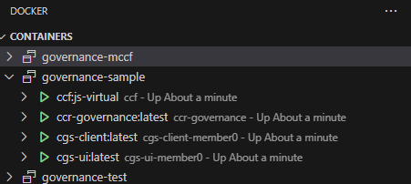
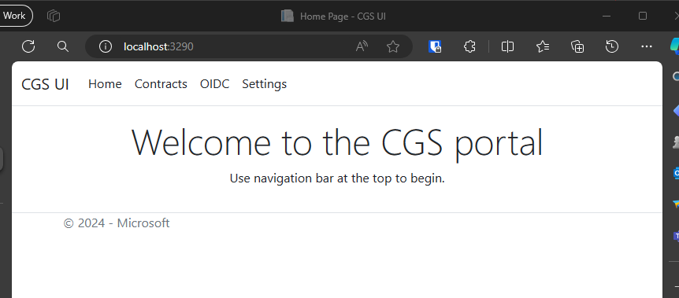

# Sample: Clean Room Governance Service<!-- omit from toc -->

- [Getting Started](#getting-started)
  - [Prerequisites](#prerequisites)
  - [Build and Deploy using Docker](#build-and-deploy-using-docker)
- [CGS CLI](#cgs-cli)
  - [Contract management](#contract-management)
  - [Deployment spec management](#deployment-spec-management)
  - [Clean room policy management](#clean-room-policy-management)
  - [Secrets management](#secrets-management)
  - [OIDC Issuer (IdP) management](#oidc-issuer-idp-management)
  - [Controlling execution](#controlling-execution)
  - [Controlling Log collection](#controlling-log-collection)
  - [Controlling Telemetry collection](#controlling-telemetry-collection)
  - [Events management](#events-management)
  - [Roles management](#roles-management)
  - [Document management](#document-management)
  - [Roles management](#roles-management-1)
- [CGS UI](#cgs-ui)

This sample demonstrates running of the clean room governance service on top of CCF. See [CGS readme](../../src/governance/README.md) for more details.

## Getting Started

The instructions below guide you through building and deploying an instance of the clean room governance CCF application for development, understanding and testing purposes. Along with deploying the CCF application a client-side `cgs-client:latest` container is also deployed that is used for interacting with the CCF application.

Being a CCF application, the service runs in SEV-SNP hardware. However, for testing purposes, it also supports running on non SEV-SNP environment in what is called *virtual* mode using Docker.

### Prerequisites
All scripts are written in
[PowerShell](https://docs.microsoft.com/en-us/powershell/scripting/overview),
so for Linux, follow [these
instructions](https://docs.microsoft.com/en-us/powershell/scripting/install/installing-powershell-core-on-linux)
to install PowerShell. Once its installed, you can run the following command to start the shell:
```sh
pwsh
```

If you do not have [Docker](https://www.docker.com/products/docker-desktop) already installed, make
sure to install it. Because most of the code builds and runs on Linux containers, you can use Docker
to develop directly on your local Linux machine without worrying about installing too
many dependencies. If you are using Windows then using Ubuntu via [WSL2](https://learn.microsoft.com/en-us/windows/wsl/install) to setup the linux environment is recommended.

### Build and Deploy using Docker

Use the following command to start a single-node CCF network with the application setup for development purposes.
```powershell
./deploy-cgs.ps1
```
The above command uses docker compose to deploy both the CCF applicaiton `ccf:js-virtual:latest`and the `cgs-client:latest` application container in docker. Additionally the `ccr-governance:latest` is also shown below which would normally run within the clean room (CACI instance).

  

## CGS CLI
Once the application has been deployed in CCF the members can interact with it using the following commands.
```powershell
# Import this first to load the commands that get used subsequently.
Import-Module ./scripts/cgs.psm1 -Force -DisableNameChecking
```
### Contract management
```powershell
# Set the environment variable where the cgs-client container is listening on.
# Default values are 9290 for a virtual/docker deployment.
# If in doubt run 'docker port <containername>' command to know the host port value.
$env:CGSCLIENT_PORT=9290

# Create a new contract.
$contractId="1221"
$data = '{"hello": "world"}'
Create-Contract -data $data -id $contractId

# Update an existing contract.
$version=(Get-Contract -id $contractId | jq -r ".version")
$data = '{"hello": "world", "foo": "bar"}'
Create-Contract -data $data -id $contractId -version $version

# Submitting a contract proposal.
$version=(Get-Contract -id $contractId | jq -r ".version")
$proposalId=(Propose-Contract -version $version -id $contractId | jq -r '.proposalId')

# Vote on a contract. If there are multiple members then each member needs to vote before the contract gets accepted.
Vote-Contract -id $contractId -proposalId $proposalId -vote accept | jq
```
### Deployment spec management
```powershell
# Propose a deployment spec which would be used to create an instance of the clean room. CGS treats the sturcture of the spec as opaque.
$spec=@"
{
  "key1": "value1",
  "key2": {
    "key3": "value3"
  }
}
"@

$proposalId=(Propose-DeploymentSpec -contractId $contractId -spec $spec | jq -r '.proposalId')

# Vote on the proposal. If there are multiple members then each member needs to vote before the spec gets accepted.
Vote-Proposal -proposalId $proposalId -vote accept | jq

# Once the proposal is accepted below command returns the accepted spec.
Get-DeploymentSpec -contractId $contractId
```

### Clean room policy management
```powershell
# Propose the clean room policy which would be used to identify calls originating from a clean room instance.
# Without this a clean room instance will be unable to get secrets, tokens or insert audit events.
$policy=@"
{
  "type": "add",
  "claims": {
    "x-ms-sevsnpvm-is-debuggable": false,
    "x-ms-sevsnpvm-hostdata": "<insert ccepolicy hash value here Eg 73973b78d70cc68353426de188db5dfc57e5b766e399935fb73a61127ea26d20>"
  }
}
"@

$proposalId=(Propose-CleanRoom-Policy -contractId $contractId -policy $policy | jq -r '.proposalId')

# Vote on the prposal. If there are multiple members then each member needs to vote before the proposal gets accepted.
Vote-Proposal -proposalId $proposalId -vote accept | jq

# Once the proposal is accepted below command returns the accepted policy.
Get-CleanRoom-Policy -contractId $contractId
```

### Secrets management
```powershell
# Add/update a secret named `clientsecret`. The command returns `secretId` which is the memberId prefixed secret name that needs to be specified as the secret ID in the clean room specification to fetch this secret.
Add-Secret -contractId $contractId -name clientsecret -value "ASDFQ==" | jq
{
  "secretId": "373d3aecb922fc7938c73b8cbef9989bf91c282e621cb8b9598b8ba7f7292820:clientsecret"
}
```

### OIDC Issuer (IdP) management
```powershell
# Enable OIDC Issuer feature in CGS.
$proposalId=(propose-enable-oidc-issuer | jq -r '.proposalId')

# Accept the above proposal. If there are multiple members then each member needs to vote before IdP gets enabled.
Vote-Proposal -proposalId $proposalId -vote accept | jq

# Once enabled trigger generation of the OIDC issuer signing key. Any member can trigger key generation.
Generate-Oidc-Issuer-Signing-Key | jq

# Get OIDC Issuer configuration details.
Get-Oidc-Issuer-Info
```

See [how to setup a public, secured OIDC Issuer URL](../governance/../../src/governance/ccf-app/js/README.md#setup-a-public-secured-oidc-issuer-url-using-azure-blob-storage) to generate the Issuer URL value to use below.
```powershell
# Set tenantId-level Issuer URL that will be exposing the /.well-known/openid-configuration and JWKS documents.
# The tenantId value is automatically picked from the member_data of the member that is invoking this cmdlet.
# This URL will be set as the 'iss' claim value for tokens issued for this tenantId.
# No proposal is required to set tenantId-level Issuer URL.
$issuerUrl= "https://..."
Set-Oidc-IssuerUrl -url $issuerUrl

# And/or set IssuerUrl at a global level that will be exposing the /.well-known/openid-configuration and JWKS documents.
# This URL will be set as the 'iss' claim value for tokens issued for any tenantId (Any explicit tenantId-level Issuer URL superseeds this value).
$issuerUrl= "https://..."
$proposalId=(Propose-Set-Oidc-IssuerUrl -url $issuerUrl | jq -r '.proposalId')

# Accept the above proposal. If there are multiple members then each member needs to vote before issuer URL gets set.
Vote-Proposal -proposalId $proposalId -vote accept | jq
```

### Controlling execution
```powershell
# Disable execution of an accepted contract. Use -action enable to reverse the action.
# Any member can disable/enable contract execution.
Set-Contract-RuntimeOption -option execution -action disable -contractId $contractId

# Check the execution status of an accepted contract.
# Contract execution status remains disabled as long as one or more members have disabled execution.
Check-Contract-RuntimeOption -contractId $contractId -statusOf execution | jq
```

### Controlling Log collection
```powershell
# Propose enabling logging and its collection during cleanroom execution.
$proposalId=(Propose-Contract-RuntimeOption -option logging -action enable -contractId $contractId | jq -r '.proposalId') 

# Vote on the proposal. If there are multiple members then each member needs to vote before the
# proposal gets accepted.
Vote-Proposal -proposalId $proposalId -vote accept | jq

# Check the logging enable/disable status of an accepted contract.
Check-Contract-RuntimeOption -contractId $contractId -statusOf logging | jq

# Propose disable logging and its collection during cleanroom execution. Any member can propose and
# the proposal gets auto-accepted. No voting required.
$proposalId=(Propose-Contract-RuntimeOption -option logging -action disable -contractId $contractId | jq -r '.proposalId') 
```

### Controlling Telemetry collection
```powershell
# Propose enabling telemetry collection during cleanroom execution.
$proposalId=(Propose-Contract-RuntimeOption -option telemetry -action enable -contractId $contractId | jq -r '.proposalId') 

# Vote on the proposal. If there are multiple members then each member needs to vote before the
# proposal gets accepted.
Vote-Proposal -proposalId $proposalId -vote accept | jq

# Check the telemetry enable/disable status of an accepted contract.
Check-Contract-RuntimeOption -contractId $contractId -statusOf telemetry | jq

# Propose disable telemetry collection during cleanroom execution. Any member can propose and
# the proposal gets auto-accepted. No voting required.
$proposalId=(Propose-Contract-RuntimeOption -option telemetry -action disable -contractId $contractId | jq -r '.proposalId')
```

### Events management
```powershell
# Get audit events (if any) emitted by the clean room during contract execution.
Get-Event -contractId $contractId -all | jq
{
  "value": [
    {
      "scope": "",
      "id": "cf9a4444",
      "seqno": 120,
      "timestamp": "1712199058629",
      "timestamp_iso": "2024-04-04T02:50:58.629Z",
      "data": {
        "message": "Contract cf9a4444 passed consent check."
      }
    },
    {
      "scope": "",
      "id": "cf9a4444",
      "seqno": 122,
      "timestamp": "1712199059821",
      "timestamp_iso": "2024-04-04T02:50:59.821Z",
      "data": {
        "message": "foo container started for contract cf9a4444."
      }
    },
    {
      "scope": "",
      "id": "cf9a4444",
      "seqno": 124,
      "timestamp": "1712199060985",
      "timestamp_iso": "2024-04-04T02:51:00.985Z",
      "data": {
        "message": "Key was released under contract cf9a4444."
      }
    },
    {
      "scope": "",
      "id": "cf9a4444",
      "seqno": 126,
      "timestamp": "1712199062122",
      "timestamp_iso": "2024-04-04T02:51:02.122Z",
      "data": {
        "message": "foo container finished execution."
      }
    }
  ]
}
```

### Roles management
By default any member can submit constitution, JS app, deployment spec and clean room policy proposals. These will have to go thru the rounds of voting where in all members need to accept the proposal for it to take affect.  

In advanced scenarios the consortium might want to make one member's proposal for certain actions go thru automatically as they are deemed to act in an *operator* capacity for that activity. That member is held responsible for performing those actions without explicit oversight. In such scenarios one needs to enable a *role* on that member and then enable *auto approval* for the actions. Following are the roles can be configured for a member:

| Role | Description |
| --- | --- |
| `cgsOperator` | Allows auto-approval for `set_constitution` and `set_js_app` proposals. |
| `contractOperator` | Allows auto-approval for `set_deployment_spec` and `set_clean_room_policy` proposals. |

If a member has such role(s) enabled on them then their proposals can get auto-approved and not require any voting. Auto approval of these actions has to be enabled explicitly via the following runtime options:
| Runtime Option | Affected Role |
| --- | --- |
| `autoapprove-constitution-proposal` | `cgsOperator`|
| `autoapprove-jsapp-proposal` | `cgsOperator`|
| `autoapprove-deploymentspec-proposal` | `contractOperator`|
| `autoapprove-cleanroompolicy-proposal` | `contractOperator`|

Below cmdlets showcase how to add/remove roles from a member and enable/disable the auto approval options.

```powershell
# Propose the member to have CGS operator role but not contract operator.
$memberId = Get-CgsClient-Config | jq -r '.memberId'
$proposalId=(Propose-Set-MemberData -memberId $memberId `
    -addRole cgsOperator `
    -removeRole contractOperator `
    | jq -r '.proposalId') 

# Vote on the proposal. If there are multiple members then each member needs to vote before the
# proposal gets accepted.
Vote-Proposal -proposalId $proposalId -vote accept | jq

# Propose enabling auto-approval for JS App proposals. After this members with cgsOperator role
# enabled wil have their proposals get accepted automatically.
$proposalId=(Propose-RuntimeOption -option autoapprove-jsapp-proposal -action enable | jq -r '.proposalId') 

# Vote on the proposal. If there are multiple members then each member needs to vote before the 
#proposal gets accepted.
Vote-Proposal -proposalId $proposalId -vote accept | jq

# Propose disabling auto-approval for clean room policy proposals. This affects members with
# contractOperator role.
$proposalId=(Propose-RuntimeOption -option autoapprove-cleanroompolicy-proposal -action disable | jq -r '.proposalId') 

# Check the status of a runtime option.
Check-RuntimeOption -statusOf autoapprove-cleanroompolicy-proposal | jq

# Check the member_data for all the members that captures the roles.
Get-Member
{
  "3d2eabf321a304f5b76d494340cce3fdf18bdf09dcb6e6a84d4cde8e20e4bd6f": {
    "cert": "...",
    "member_data": {
      "cgsRoles": {
        "contractOperator": "true"
      },
      "identifier": "member2",
      "tenantId": "72f988bf-86f1-41af-91ab-2d7cd011db47"
    },
    "public_encryption_key": null,
    "status": "Active"
  },
  "d099eb4afd9f8f2ce10dcad8cf8afe765a2525f7478de3dc1a451041defc9d37": {
    "cert": "...",
    "member_data": {
      "identifier": "member0"
    },
    "public_encryption_key": "...",
    "status": "Active"
  },
  "e4bd4b15162591697c8f834ad1792a0901906e7b4a4984b3afe0a38832939f5d": {
    "cert": "...",
    "member_data": {
      "identifier": "member1",
      "tenantId": "72f988bf-86f1-41af-91ab-2d7cd011db47"
    },
    "public_encryption_key": null,
    "status": "Active"
  }
}
```

### Document management
```powershell
# Create a new document under a contract.
$contractId="<AnExistingContractId>"
$documentId="1221"
$data = '{"hello": "world"}'
Create-Document -data $data -id $documentId -contractId $contractId

# Update an existing document.
$version=(Get-Document -id $documentId | jq -r ".version")
$data = '{"hello": "world", "foo": "bar"}'
Create-Document -data $data -id $documentId -contractId $contractId -version $version

# Submitting a document proposal.
$version=(Get-Document -id $documentId | jq -r ".version")
$proposalId=(Propose-Document -version $version -id $documentId | jq -r '.proposalId')

# Vote on a document. If there are multiple members then each member needs to vote before the document gets accepted.
Vote-Document -id $documentId -proposalId $proposalId -vote accept | jq
```

### Roles management
By default any member can submit constitution, JS app, deployment spec and clean room policy proposals. These will have to go thru the rounds of voting where in all members need to accept the proposal for it to take affect.  

In advanced scenarios the consortium might want to make one member's proposal for certain actions go thru automatically as they are deemed to act in an *operator* capacity for that activity. That member is held responsible for performing those actions without explicit oversight. In such scenarios one needs to enable a *role* on that member and then enable *auto approval* for the actions. Following are the roles can be configured for a member:

| Role | Description |
| --- | --- |
| `cgsOperator` | Allows auto-approval for `set_constitution` and `set_js_app` proposals. |
| `contractOperator` | Allows auto-approval for `set_deployment_spec` and `set_clean_room_policy` proposals. |

If a member has such role(s) enabled on them then their proposals can get auto-approved and not require any voting. Auto approval of these actions has to be enabled explicitly via the following runtime options:
| Runtime Option | Affected Role |
| --- | --- |
| `autoapprove-constitution-proposal` | `cgsOperator`|
| `autoapprove-jsapp-proposal` | `cgsOperator`|
| `autoapprove-deploymentspec-proposal` | `contractOperator`|
| `autoapprove-cleanroompolicy-proposal` | `contractOperator`|

Below cmdlets showcase how to add/remove roles from a member and enable/disable the auto approval options.

```powershell
# Propose the member to have CGS operator role but not contract operator.
$memberId = Get-CgsClient-Config | jq -r '.memberId'
$proposalId=(Propose-Set-MemberData -memberId $memberId `
    -addRole cgsOperator `
    -removeRole contractOperator `
    | jq -r '.proposalId') 

# Vote on the proposal. If there are multiple members then each member needs to vote before the
# proposal gets accepted.
Vote-Proposal -proposalId $proposalId -vote accept | jq

# Propose enabling auto-approval for JS App proposals. After this members with cgsOperator role
# enabled wil have their proposals get accepted automatically.
$proposalId=(Propose-RuntimeOption -option autoapprove-jsapp-proposal -action enable | jq -r '.proposalId') 

# Vote on the proposal. If there are multiple members then each member needs to vote before the 
#proposal gets accepted.
Vote-Proposal -proposalId $proposalId -vote accept | jq

# Propose disabling auto-approval for clean room policy proposals. This affects members with
# contractOperator role.
$proposalId=(Propose-RuntimeOption -option autoapprove-cleanroompolicy-proposal -action disable | jq -r '.proposalId') 

# Check the status of a runtime option.
Check-RuntimeOption -statusOf autoapprove-cleanroompolicy-proposal | jq

# Check the member_data for all the members that captures the roles.
Get-Member
{
  "3d2eabf321a304f5b76d494340cce3fdf18bdf09dcb6e6a84d4cde8e20e4bd6f": {
    "cert": "...",
    "member_data": {
      "cgsRoles": {
        "contractOperator": "true"
      },
      "identifier": "member2",
      "tenantId": "72f988bf-86f1-41af-91ab-2d7cd011db47"
    },
    "public_encryption_key": null,
    "status": "Active"
  },
  "d099eb4afd9f8f2ce10dcad8cf8afe765a2525f7478de3dc1a451041defc9d37": {
    "cert": "...",
    "member_data": {
      "identifier": "member0"
    },
    "public_encryption_key": "...",
    "status": "Active"
  },
  "e4bd4b15162591697c8f834ad1792a0901906e7b4a4984b3afe0a38832939f5d": {
    "cert": "...",
    "member_data": {
      "identifier": "member1",
      "tenantId": "72f988bf-86f1-41af-91ab-2d7cd011db47"
    },
    "public_encryption_key": null,
    "status": "Active"
  }
}
```
## CGS UI
Once the application has been deployed in CCF one can perform some basic interactions via a web-based user interface that is hosted locally. Use a web browser to open the page.

**Docker CCF deployment**  
http://localhost:6290



