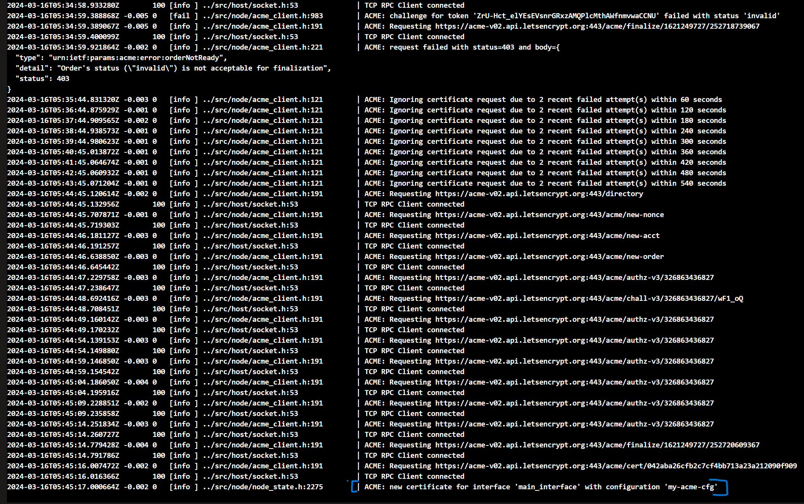

## ACME-endorsed TLS certificate for CGS

This sample demonstrates setting up [ACME-endorsed TLS certificates](https://microsoft.github.io/CCF/main/operations/certificates.html#acme-endorsed-tls-certificates) that gets used during the TLS/SSL handshake when interacting with the CGS endpoint. This way the CCF endpoint becomes reachable via a domain name (`service_dns_name` value in [acme.configurations](https://microsoft.github.io/CCF/main/operations/configuration.html#configurations) section) that presents a certificate issued by the [Let's Encrypt](https://letsencrypt.org/) CA.

The sample does the following:
- Requires acquisition of a domain name which is specified as the `service_dns_name` in the acme configuration. In this example the domain name was taken from duckdns.org which is a free sub-domain provider.
- Builds a custom CCF container image that has the ACME configuration in it and then deploys that image onto ACI. The domain name that was acquired should be configured to point to the public IP address of this ACI container instance.
- CCF on start requests a certificate from Let's Encrypt for the domain name.

## Deployment
```pwsh
# Set below to the value of the duckdns.org domain name that will get pointed to the ACI IP address.
$subdomain="cgssvc"
$rg="gsinha-test-rg"
$acrLoginServer="docker.io/gausinha"
$serviceDnsName="$subdomain.duckdns.org"
$endpoint="https://$serviceDnsName:8080"

# Build the custom CCF image, push it to a container registry ($acrLoginServer) and then deploy to ACI.
docker login $acrLoginServer
./samples/governance/acme-tls/deploy-ccf.ps1 -BuildAndPush -ServiceDnsName $serviceDnsName -acrLoginServer $acrLoginServer -rg $rg

# Update the DNS registration with the IP address of the ACI deployment above.
./samples/governance/acme-tls/update-duckdns.ps1 -token "<token value from duckdns.org account>" -domain $subdomain -rg $rg

# Wait for $serviceDnsName to resolve to ACI IP address. Should be quick. Then run the below:
 /samples/governance/acme-tls/deploy-cgs.ps1 -ccfEndpoint $endpoint -signingCert ./samples/governance/acme-tls/sandbox_common/member0_cert.pem -signingKey ./samples/governance/acme-tls/sandbox_common/member0_privk.pem
```

Below is the output of the container logs for such an ACI deployment.


