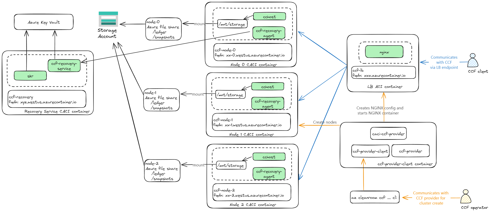
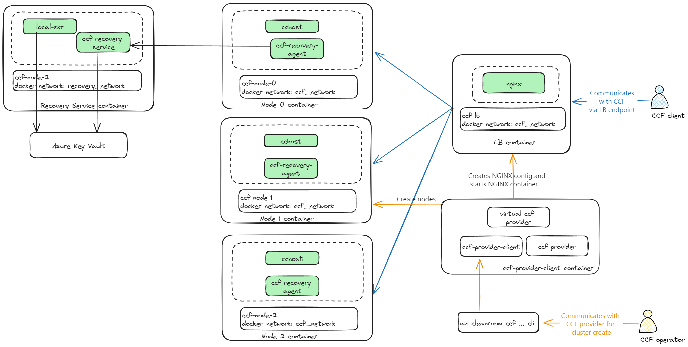

# CCF <!-- omit from toc -->
- [1. Introduction](#1-introduction)
- [2. High level layout](#2-high-level-layout)
  - [2.1. CACI (SNP) environment](#21-caci-snp-environment)
  - [2.2. Virtual (insecure) environment](#22-virtual-insecure-environment)
- [3. Quickstart: CCF network creation](#3-quickstart-ccf-network-creation)
- [4. CCF network creation with Confidential Recovery](#4-ccf-network-creation-with-confidential-recovery)
- [5. CCF network creation with Operator Recovery](#5-ccf-network-creation-with-operator-recovery)
- [6. Performing recovery](#6-performing-recovery)
  - [6.1. Confidential Recovery](#61-confidential-recovery)
  - [6.2. Operator recovery](#62-operator-recovery)
- [7. CCF network code upgrade](#7-ccf-network-code-upgrade)

## 1. Introduction
The infra provided here enables [CCF](https://github.com/microsoft/ccf?tab=readme-ov-file#get-started-with-ccf) network creation on top of Azure Confidential Computing offerings such as  on AMD SEV-SNP using Confidential ACI (CACI). The following capabilities are enabled:
  - Create a CCF network with CCF nodes running on CACI.
  - Create a CCF network with CCF nodes running in an insecure virtual mode for dev/test.

See [recovery](./docs/recovery.md) section for details around recovering a CCF network.

## 2. High level layout
The CCF network management is realized using the following components:
- `ccf-provider`: Provides an API for CCF provisioning and operating CCF networks.
- `ccf-provider-client`: A client container that runs on customer's (aka CCF operators) premise to interact with the ccf-provider instance.
- `Clean Room Az CLI commands`: Commands to help manage CCF networks via the ccf-provider-client instance.
- `caci-ccf-provider`, `virtual-ccf-provider`: Various infra provider implementations that back the `ccf-provider` APIs to realize the CCF network creation on platforms such as CACI, virtual Docker environment etc.

### 2.1. CACI (SNP) environment


### 2.2. Virtual (insecure) environment


## 3. Quickstart: CCF network creation
To simply get going and play around with a CCF network run the below command:
```powershell
$networkName = "<your-network-name>"
$resourceGroup = "<an-existing-rg-name>"

az cleanroom ccf network up --name $networkName --resource-group $resourceGroup
```
The above command deploys the simplest possible CACI based CCF network with 1 node, with a single operator. Further members can be added later. The key benefit of this command is it's a single call to get an entire network created with all relevant configuration options, and identities stored in a workspace directory.

Once familiar with a CCF network follow the steps below that show the steps involved in creating a CCF network in operator recovery mode that the `ccf network up` command was performing underneath. CCF network can also be created with Confidential Recovery, which is covered next.

## 4. CCF network creation with Confidential Recovery
Below are the steps to create a 1-node CCF network with confidential recovery. The high level steps are:
1. Create the CCF operator member
2. Create Azure resources (like Key Vault, Mananged Identity) used for confidential recovery of the network
3. Create the Confidential Recovery service
4. Create the CCF network
5. Configure confidential recovery on the CCF network

```powershell
$sandbox_common = "ccf-network"
mkdir -p $sandbox_common
if (!(Test-Path "$sandbox_common/uniqueString.txt")) {
    $uniqueString = $((New-Guid).ToString().Substring(0, 8))
    $uniqueString | Out-File "$sandbox_common/uniqueString.txt"
}

$uniqueString = Get-Content "$sandbox_common/uniqueString.txt"
$resourceGroup = "ccf-deploy-$uniqueString"
Write-Output "Resource group: $resourceGroup"

$location = "westus"
$storageAccountName = "ccf${uniqueString}sa"
az group create --name $resourceGroup --location westus

$networkName = "ccf-network"
$subscriptionId = az account show --query "id" -o tsv

# Create a storage account for using Azure File shares for the CCF nodes.
az storage account create `
    --name $storageAccountName `
    --resource-group $resourceGroup `
    --allow-shared-key-access true

$storageAccountId = az storage account show `
    --name $storageAccountName `
    --resource-group $resourceGroup `
    --query "id" `
    --output tsv

# Create the CCF operator member.
$operatorName = "operator"
if (!(Test-Path "$sandbox_common/${operatorName}_cert.pem")) {
    az cleanroom governance member keygenerator-sh | bash -s -- --name $operatorName --out $sandbox_common 

}

@"
[{
    "certificate": "$sandbox_common/${operatorName}_cert.pem",
    "memberData": {
        "identifier": "$operatorName",
        "isOperator": true
    }
}]
"@ >  $sandbox_common/members.json

@"
{
    "location": "$location",
    "subscriptionId": "$subscriptionId",
    "resourceGroupName": "$resourceGroup",
    "azureFiles": {
        "storageAccountId": "$storageAccountId"
    }
}
"@ >  $sandbox_common/providerConfig.json

# Create the Azure resources like Key Vault, Managed Identity etc and then create the service.
$root = git rev-parse --show-toplevel
pwsh $root/samples/ccf/azcli/recovery/prepare-resources.ps1 `
    -resourceGroup $resourceGroup `
    -outDir $sandbox_common
$resources = $(Get-Content $sandbox_common/recoveryResources.json | ConvertFrom-Json)

az cleanroom ccf provider deploy

# Generated the initial security policy for the ccf network that gets configured in the recovery service.
az cleanroom ccf network security-policy generate-join-policy `
| Out-File $sandbox_common/networkJoinPolicy.json

# Create the conf. recovery service which will be configured later for the CCF network.
az cleanroom ccf recovery-service create `
    --name $networkName `
    --key-vault $resources.kvId `
    --maa-endpoint $resources.maaEndpoint `
    --identity $resources.miId `
    --ccf-network-join-policy $sandbox_common/networkJoinPolicy.json `
    --provider-config $sandbox_common/providerConfig.json

# Create the CCF network, activate operator membership and then configure confidential recovery.
$response = (az cleanroom ccf network create `
    --name $networkName `
    --members $sandbox_common/members.json `
    --provider-config $sandbox_common/providerConfig.json | ConvertFrom-Json)
$ccfEndpoint = $response.endpoint
$response = (curl "$ccfEndpoint/node/network" -k --silent | ConvertFrom-Json)
# Trimming an extra new-line character added to the cert.
$response.service_certificate.TrimEnd("`n") | Out-File "$sandbox_common/service_cert.pem"

# Deploy the governance client for the operator to take any gov actions.
$cgsProjectName = "ccf-network-governance"
az cleanroom governance client deploy `
    --ccf-endpoint $ccfEndpoint `
    --signing-key $sandbox_common/${operatorName}_privk.pem `
    --signing-cert $sandbox_common/${operatorName}_cert.pem `
    --service-cert $sandbox_common/service_cert.pem `
    --name $cgsProjectName

# Activate the operator membership by default in the cluster that just got created.
az cleanroom governance member activate --governance-client $cgsProjectName

# Configure the ccf provider client for the operator to take any operator actions like opening
# the network.
az cleanroom ccf provider configure `
    --signing-key $sandbox_common/${operatorName}_privk.pem `
    --signing-cert $sandbox_common/${operatorName}_cert.pem

# Configure confidential recovery.
$confidentialRecovererMemberName = "confidential-recoverer"
az cleanroom ccf network configure-confidential-recovery `
    --name $networkName `
    --recovery-service-name $networkName `
    --recovery-member-name $confidentialRecovererMemberName `
    --provider-config $sandbox_common/providerConfig.json

# Open the network as the operator.
az cleanroom ccf network transition-to-open `
    --name $networkName `
    --provider-config $sandbox_common/providerConfig.json

Write-Output "CCF network successfully created at $ccfEndpoint"
```
See the [CCF CLI readme](../tools/azure-cli-extension/cleanroom/README.md#ccf) for more variations around creating CCF environments.

## 5. CCF network creation with Operator Recovery
Below are the steps to create a 1-node CCF network with operator recovery. The high level steps are:
1. Create the CCF operator member with encryption (recovery) key
2. Create the CCF network with operator encryption key

```powershell
$sandbox_common = "ccf-network-operator"
mkdir -p $sandbox_common
if (!(Test-Path "$sandbox_common/uniqueString.txt")) {
    $uniqueString = $((New-Guid).ToString().Substring(0, 8))
    $uniqueString | Out-File "$sandbox_common/uniqueString.txt"
}

$uniqueString = Get-Content "$sandbox_common/uniqueString.txt"
$resourceGroup = "ccf-deploy-$uniqueString"
Write-Output "Resource group: $resourceGroup"

$location = "westus"
$storageAccountName = "ccf${uniqueString}sa"
az group create --name $resourceGroup --location westus

$networkName = "ccf-network-op"
$subscriptionId = az account show --query "id" -o tsv

# Create a storage account for using Azure File shares for the CCF nodes.
az storage account create `
    --name $storageAccountName `
    --resource-group $resourceGroup `
    --allow-shared-key-access true

$storageAccountId = az storage account show `
    --name $storageAccountName `
    --resource-group $resourceGroup `
    --query "id" `
    --output tsv

# Create the CCF operator member with encryption (recovery) key.
$operatorName = "operator"
if (!(Test-Path "$sandbox_common/${operatorName}_cert.pem")) {
    az cleanroom governance member keygenerator-sh | bash -s -- --name $operatorName --gen-enc-key --out $sandbox_common

}

@"
[{
    "certificate": "$sandbox_common/${operatorName}_cert.pem",
    "encryptionPublicKey": "$sandbox_common/${operatorName}_enc_pubk.pem",
    "memberData": {
        "identifier": "$operatorName",
        "isOperator": true
    }
}]
"@ >  $sandbox_common/members.json

@"
{
    "location": "$location",
    "subscriptionId": "$subscriptionId",
    "resourceGroupName": "$resourceGroup",
    "azureFiles": {
        "storageAccountId": "$storageAccountId"
    }
}
"@ >  $sandbox_common/providerConfig.json

az cleanroom ccf provider deploy

# Create the CCF network and activate operator membership.
$response = (az cleanroom ccf network create `
    --name $networkName `
    --members $sandbox_common/members.json `
    --provider-config $sandbox_common/providerConfig.json | ConvertFrom-Json)
$ccfEndpoint = $response.endpoint
$response = (curl "$ccfEndpoint/node/network" -k --silent | ConvertFrom-Json)
# Trimming an extra new-line character added to the cert.
$response.service_certificate.TrimEnd("`n") | Out-File "$sandbox_common/service_cert.pem"

# Deploy the governance client for the operator to take any gov actions.
$cgsProjectName = "ccf-network-governance"
az cleanroom governance client deploy `
    --ccf-endpoint $ccfEndpoint `
    --signing-key $sandbox_common/${operatorName}_privk.pem `
    --signing-cert $sandbox_common/${operatorName}_cert.pem `
    --service-cert $sandbox_common/service_cert.pem `
    --name $cgsProjectName

# Activate the operator membership by default in the cluster that just got created.
az cleanroom governance member activate --governance-client $cgsProjectName

# Configure the ccf provider client for the operator to take any operator actions like opening
# the network.
az cleanroom ccf provider configure `
    --signing-key $sandbox_common/${operatorName}_privk.pem `
    --signing-cert $sandbox_common/${operatorName}_cert.pem

# Open the network as the operator.
az cleanroom ccf network transition-to-open `
    --name $networkName `
    --provider-config $sandbox_common/providerConfig.json

Write-Output "CCF network successfully created at $ccfEndpoint"
```
## 6. Performing recovery
Check the network health:
```powershell
az cleanroom ccf network show-health `
    --name $networkName `
    --provider-config $sandbox_common/providerConfig.json
```
Sample healthy network output:
```json
{
  "loadBalancerHealth": {
    "endpoint": "https://lb-nw-ccf-network-op-xxxx.westus.azurecontainer.io:443",
    "name": "lb-nw-ccf-network-op",
    "reasons": [],
    "status": "Ok"
  },
  "nodeHealth": [
    {
      "endpoint": "ccf-network-op-0-xxxx.westus.azurecontainer.io:8080",
      "name": "ccf-network-op-0",
      "reasons": [],
      "status": "Ok"
    }
  ]
}
```
Sample unhealthy network output:
```json
{
  "loadBalancerHealth": {
    "endpoint": "https://lb-nw-ccf-network-op-xxxx.westus.azurecontainer.io:443",
    "name": "lb-nw-ccf-network-op",
    "reasons": [],
    "status": "Ok"
  },
  "nodeHealth": [
    {
      "endpoint": "ccf-network-op-0-xxxx.westus.azurecontainer.io:8080",
      "name": "ccf-network-op-0",
      "reasons": [
        {
          "code": "ContainerTerminated",
          "message": "Following container(s) are reporting as terminated. ccf-cchost. ccr-attestation. ccf-recovery-agent. ccr-proxy."
        },
        {
          "code": "ContainerGroupStopped",
          "message": "The container group ccf-network-op-0 is reporting state as stopped."
        }
      ],
      "status": "NeedsReplacement"
    }
  ]
}
```
If the network health is reporting `NeedsReplacement` then one needs to perform recovery.
Note that performing recovery changes the CCF service identity certificate and clients need to use the new 
certificate (`service_cert_new.pem` below) for communicating with the recovered CCF instance.

### 6.1. Confidential Recovery
For a network that was created with confidential recovery service the recovery is done as below:
```powershell
$response = (az cleanroom ccf network recover `
    --name $networkName `
    --confidential-recovery-service-name $networkName `
    --confidential-recovery-member-name $confidentialRecovererMemberName `
    --previous-service-cert $sandbox_common/service_cert.pem `
    --provider-config $sandbox_common/providerConfig.json | ConvertFrom-Json)

$ccfEndpoint = $response.endpoint
$response = (curl "$ccfEndpoint/node/network" -k --silent | ConvertFrom-Json)
# Trimming an extra new-line character added to the cert.
$response.service_certificate.TrimEnd("`n") | Out-File "$sandbox_common/service_cert_new.pem"
```

### 6.2. Operator recovery
For a network that was created with the operator as the recovery member recovery is done as below:
```powershell
$response = (az cleanroom ccf network recover `
    --name $networkName `
    --operator-recovery-encryption-private-key $sandbox_common/${operatorName}_enc_privk.pem `
    --previous-service-cert $sandbox_common/service_cert.pem `
    --provider-config $sandbox_common/providerConfig.json | ConvertFrom-Json)

$ccfEndpoint = $response.endpoint
$response = (curl "$ccfEndpoint/node/network" -k --silent | ConvertFrom-Json)
# Trimming an extra new-line character added to the cert.
$response.service_certificate.TrimEnd("`n") | Out-File "$sandbox_common/service_cert_new.pem"
```

## 7. CCF network code upgrade
Use the below command to determine the security policy that will get used for starting the first node or adding new nodes for a network.
```pwsh
az cleanroom ccf network security-policy generate
```
Sample output for above command:
```json
{
  "snp" : {
    "securityPolicyCreationOption": "cached",
    "hostData": {
      "30637f1e00a2f776476c83484d79db08a25e92099e7c481fb23b468b439ed213": "<policy rego>"
    }
  }
}
```
One can also pass `--security-policy-creation-option [cached|cached-debug|allow-all]` parameter to the above command to generate a policy that enables debugging (`cached-debug`) or a insecure allow all policy that is useful for dev/test of the container images running in the network but provides no security guarantees (`allow-all`). Default value of this option is `cached`.
```pwsh
az cleanroom ccf network security-policy generate `
    --security-policy-creation-option allow-all
```
Building upon the [code upgrade flow](https://microsoft.github.io/CCF/main/operations/platforms/snp.html#governance-proposals) for CCF hosted in a CACI environment run the below command to add a trusted security policy, e.g. when adding a new trusted container image as part of the code upgrade procedure.
```pwsh
$securityPolicy = <path/to/some/policy.rego>
$hostData = cat $securityPolicy | sha256sum | cut -d ' ' -f 1
az cleanroom ccf network join-policy add-snp-host-data `
    --name $networkName `
    --host-data $hostData `
    --security-policy $securityPolicy `
    --provider-config $sandbox_common/providerConfig.json
```
To remove a security policy value run:
```pwsh
az cleanroom ccf network join-policy remove-snp-host-data `
    --name $networkName `
    --host-data $hostData `
    --provider-config $sandbox_common/providerConfig.json
```

To retrieve the current policy data which determines whether new nodes are permitted to join the network run:
```pwsh
az cleanroom ccf network join-policy show `
    --name $networkName `
    --provider-config $sandbox_common/providerConfig.json
```
Sample output:
```json
{
  "sgx": {
    "measurements": []
  },
  "snp": {
    "hostData": {
      "73973b78d70cc68353426de188db5dfc57e5b766e399935fb73a61127ea26d20": "package policy\n\napi_svn := \"0.10.0\"\n\nmount_device := {\"allowed\": true}\nmount_overlay := {\"allowed\": true}\ncreate_container := {\"allowed\": true, \"env_list\": null, \"allow_stdio_access\": true}\nunmount_device := {\"allowed\": true} \nunmount_overlay := {\"allowed\": true}\nexec_in_container := {\"allowed\": true, \"env_list\": null}\nexec_external := {\"allowed\": true, \"env_list\": null, \"allow_stdio_access\": true}\nshutdown_container := {\"allowed\": true}\nsignal_container_process := {\"allowed\": true}\nplan9_mount := {\"allowed\": true}\nplan9_unmount := {\"allowed\": true}\nget_properties := {\"allowed\": true}\ndump_stacks := {\"allowed\": true}\nruntime_logging := {\"allowed\": true}\nload_fragment := {\"allowed\": true}\nscratch_mount := {\"allowed\": true}\nscratch_unmount := {\"allowed\": true}\n"
    },
    "measurements": [],
    "uvmEndorsements": {
      "did:x509:0:sha256:I__iuL25oXEVFdTP_aBLx_eT1RPHbCQ_ECBQfYZpt9s::eku:1.3.6.1.4.1.311.76.59.1.2": {
        "ContainerPlat-AMD-UVM": {
          "svn": "100"
        }
      }
    }
  }
}
```