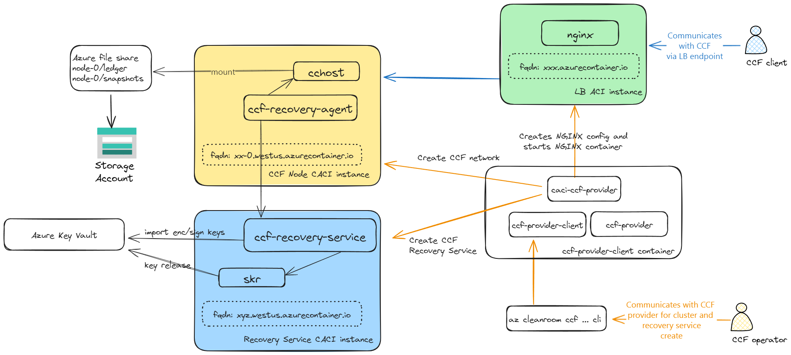
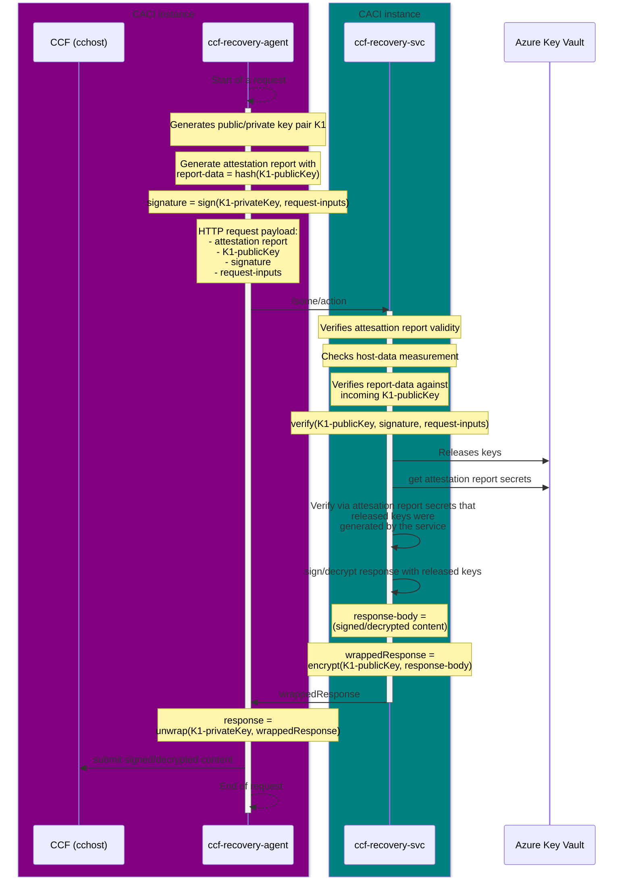
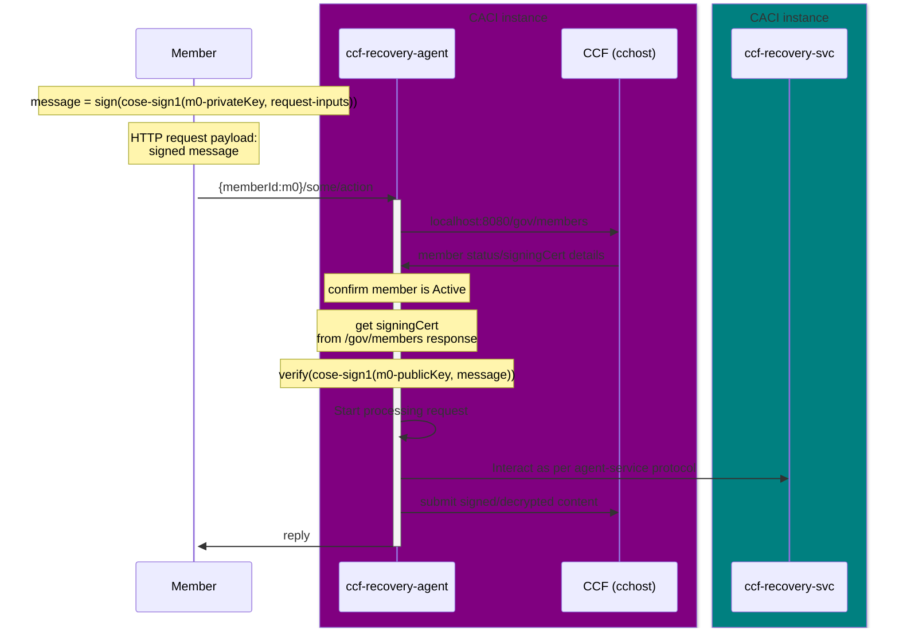
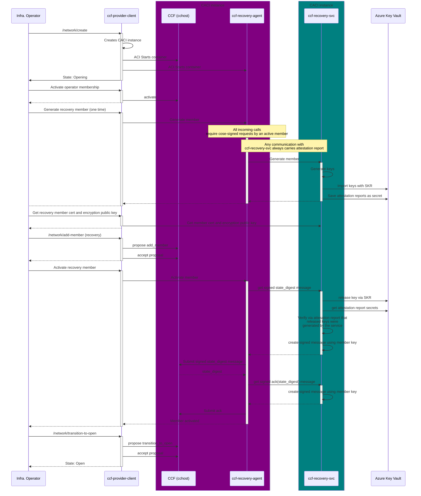
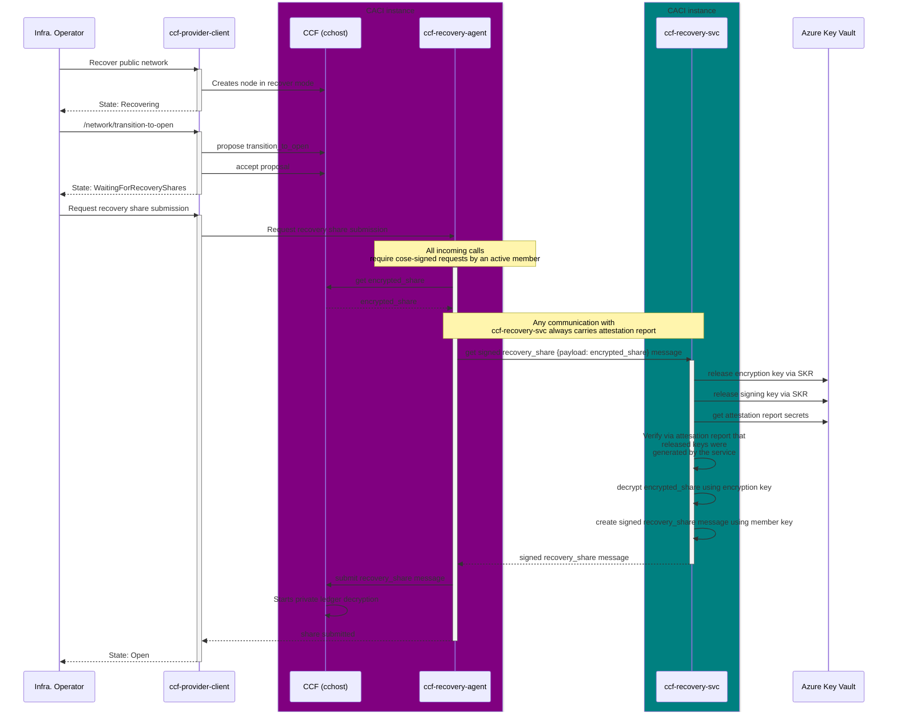

# CCF Recovery <!-- omit from toc -->
- [1. Overview](#1-overview)
- [2. High level deployment layout](#2-high-level-deployment-layout)
- [3. Recovery Service key generation](#3-recovery-service-key-generation)
- [4. Recovery Service key consumption](#4-recovery-service-key-consumption)
- [5. Recovery Agent to Service communication protocol](#5-recovery-agent-to-service-communication-protocol)
- [6. CCF member to Recovery Agent communication protocol](#6-ccf-member-to-recovery-agent-communication-protocol)
- [7. CCF network creation with Confidential Recovery](#7-ccf-network-creation-with-confidential-recovery)
- [8. CCF network recovery with Confidential Recovery](#8-ccf-network-recovery-with-confidential-recovery)
- [9. Recovery Service and Agent lifetime](#9-recovery-service-and-agent-lifetime)
- [10. Recovery Service model for establishing trust with CCF networks](#10-recovery-service-model-for-establishing-trust-with-ccf-networks)
  - [10.1. Handling CCF network code upgrade](#101-handling-ccf-network-code-upgrade)
- [11. Recovery Service code upgrade](#11-recovery-service-code-upgrade)

# 1. Overview
Building upon the [disaster recovery](https://microsoft.github.io/CCF/main/operations/recovery.html) flow
for CCF the aim is to orchestrate a CCF network recovery that meets the following requirements:
- CCF network operator (ie infra operator) is not required to be CCF recovery member
- Members of the consortium are not required to be CCF recovery members
- A recovery-only member ie *recovery operator* can be added which provides their encryption public key
- The recovery operator member is the only member required for submitting a recovery share and thus completing private ledger recovery
- The recovery operator has no voting powers in the consortium
- The recovery operator is not capable of decrypting the private ledger entries out of band and access ledger secrets

To have the 0-trust requirements on this recovery operator that is both verifiable and technically enforceable the recovery operator role is performed by a *CCF Recovery Service* (`ccf-recovery-service`) that runs in Confidential Computing environment (CACI). The measurement of the code that the service runs gets attested and its behavior can hence be verified.  Further a *CCF Recovery Agent* (`ccf-recovery-agent`) runs as part of the CCF network (within the CCF node) to interact with the CCF members, Recovery Service and the CCF network (`cchost`) and completes the overall orchestration of the scenarios. 

# 2. High level deployment layout
Below diagram captures a single node CCF network deployment layout along with the recovery components. The remaining sections go into the details of the interactions.



# 3. Recovery Service key generation
 To act as a recovery member the recovery service generates in-memory encryption and signing key pairs and then imports the same into Azure Key Vault with an immutable key release policy that is tied to the host-data measurement of its code and the platform its running on. It also uploads the attestation reports tied to these key pairs as secrets in Azure Key Vault. The secrets along with the keys can be used by the service at the time of key release to validate that the released key was a key pair that was generated and imported by an instance of this service runing in a TEE in the past.

We thus ensure that the recovery operator's signing and encryption keys are never generated nor accessible outside of a verifiably trusted confidential computing environment.

# 4. Recovery Service key consumption
The recovery operator encryption/signing keys need to be used to cose-sign requests being made to the CCF network as the recovery member and to also decrypt an encrypted recovery share and submit the same to CCF at the time of recovery. To orchestrate these flows that maintain 0-trust assurances a component named *CCF Recovery Agent* (`ccf-recovery-agent`) runs as a sidecar container within the same confidential container group as the `ccfhost` process and only this agent can interact with the CCF recovery service for it to either sign requests or decrypt an encrypted share.

By virtue of running in the same container group instance as the `cchost` we can have a measurement of both these containers and create an attestation report that can be presented to the CCF recovery service whenever the agent invokes the service.

The next few sections capture the protocol for any interactions from the agent to the service and from the members to the agent. After that we go over the exact sequence of steps required for CCF network creation and recovery to realize this *Confidential Recovery* capability.

# 5. Recovery Agent to Service communication protocol

With the above protocol the recovery service can perform sensitive actions and relay the response back to the agent so that it can submit the same to CCF with the assurance that its response is available only to a client it trusts (as per acceptable host-data measurement values). The response is encrypted via a key that is available only with the client that generated the key pair and its corresponding attestation report.

# 6. CCF member to Recovery Agent communication protocol
The recovery agent interactions with the recovery service (as per protocol above) happen as part of a request that a member of consortium initiates. For example, as part of network creation or recovery a member of the consortium would request the recovery agent to perform certain actions that then involve the recovery service (exact sequence of the interactions are captured later on). The protocol for any interaction from a member (or more precisely client code that can sign requests as a member) with the agent is as follows:

With the above protocol the recovery agent perform sensitive actions in concert with the recovery service only if the client was an active member of the consortium. The agent is assured that an active member is making a request while recovery service is assured that its responses will only be available to a recovery agent running right next to (within TCB) the `cchost` instance of the network for which it is sending its response.

With the above member to agent and agent to service communication protocols in place the exact sequence of message exchanges that happen as part of CCF network creation and CCF network recovery are captured below.

# 7. CCF network creation with Confidential Recovery

# 8. CCF network recovery with Confidential Recovery


# 9. Recovery Service and Agent lifetime
An instance of recovery service needs to be running only during the time of network creation and 
then at the time of recovery. During the course of the normal usage of the CCF network one can stop/delete
the Recovery Service instance and start/create it again when needed. There is no inherent state within
the service or continuous interactions with the service that requires it to be kept alive.

The recovery agent is a sidecar that runs next to the `cchost` instance and thus its lifetime is tied to the
lifetime of the CCF node instance.

# 10. Recovery Service model for establishing trust with CCF networks
When the recovery agent communicates with the recovery service it presents the attestation report
which the service validates (the *verifies attesattion report validity* step in the [agent to service communication protocol](#5-recovery-agent-to-service-communication-protocol)). The attestation report contains 
the `hostData` value which captures the security policy (CCE policy) that the CCF network is running with. The recovery service needs a vetted set of host data values that will be trusted.

The initial trusted set of host data values are supplied to the recovery service as part of its configuration via document that has the following format:
```json
{
  "snp": {
    "hostData": [
      "73973b78d70cc68353426de188db5dfc57e5b766e399935fb73a61127ea26d20",
      "43523b78d70cc68353426de188db5dfc57e5b766e399935fb73a61127ea27e30"
    ]
  }
}
```
 ## 10.1. Handling CCF network code upgrade
 When planning CCF network code upgrade an important point to note is that the `hostData` value of the CCF network nodes would change due to new nodes getting added/updated in the network. These nodes running new code will be unable to communicate with the recovery service until the recovery service is updated with the new value.
 > [!WARNING]
> If a CCF network upgrade is perfomed without updating the recovery service then that will break the ability to recover the CCF network if the network goes down. It is important to follow the sequence of steps laid down below as part of the CCF network upgrade workflow.

The following steps must be taken to support upgrading the CCF network nodes:  
1. Raise the `add_snp_host_data` proposal in the network that proposes the new `hostData` value of the nodes that will join the network. Use the `az cleanroom ccf network join-policy add-snp-host-data` command.
2. Have all active members vote on the above proposal for it to get accepted.
3. Ensure that the new value is being reported. Use the `az cleanroom ccf network join-policy show` command.
4. Update the recovery service via the recovery agent with the join policy that is now set on the network. Use the `az cleanroom ccf network recovery-agent set-network-join-policy` command.
5. Ensure that both the CCF network and the recovery service is reporting the same set of `hostData` values as the CCF network. Compare outputs of `az cleanroom ccf network join-policy show` and `az cleanroom ccf recovery-service api network show-join-policy`.

Only after the new `hostData` value has been successfully configured in both the CCF network and the recovery service should one proceed to performing the actual node upgrade.

# 11. Recovery Service code upgrade
When a recovery service instance is in use it has generated recovery member key(s) that 
are tied to the `hostData` value of that running instance. If another recovery service 
instance is started with a change in its code then it will not be able to release the 
recovery member keys from Azure Key Vault as the `hostData` value of this new instance 
would be different and Key Vault would only release the keys to an instance running 
with the original `hostData` value.

The following steps must be taken to support upgrading to a new recovery service instance:  
1. Lets say the current instance of the recovery service is called `R-current-service` and its member is referred to as `R-current-member`. 
2. Deploy a new instance of the service referred to as `R-new-service`.
3. Request the recovery agent of the CCF network to add a new recovery member named `R-new-member` in `R-new-service`.
4. Raise a proposal to add `R-new-member` as a recovery operator in the network.
5. All active members vote to accept the new `R-new-member`.
6. Request the recovery agent of the CCF network to have `R-new-service` accept the membership for  `R-new-member`.

Once the above steps are done both the `R-current-service`  and `R-new-service` would be able to recover the CCF network using their respective members. As a next step the `R-current-member` can be removed from the consortium if the older instance of the recovery service is being removed.

The above approach requires members to effectively accept the new service by accepting the membership of a new recovery operator that is tied to the new service instance. Benefits of this approach are:
- No rekey operation is required to release and re-import the `R-current-member` key in AKV with a new `hostData` value of the new service.
- It builds upon the same flow used to accept the recovery operator of the very first recovery service instance.
- The same flow can be used for changing the recovery member in the same instance of the recovery service if a need arises to do so.
- This requires no custom proposal and/or new agent to service API to handle upgrade. We build upon the flows used to add a recovery operator in the consortium.
