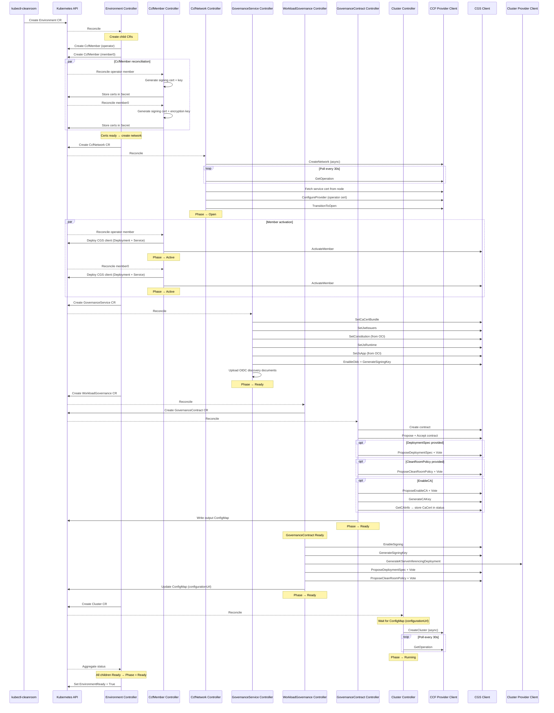

# How It Works: Environment

An `Environment` is the top-level resource. It creates six child
resources and aggregates their status. The Environment controller
itself makes no external calls — it is a pure orchestrator.

## Conditions

The CLI tracks these conditions during `environment create` or
`environment wait`:

| Condition                 | Child resource       | What it means                                                        |
| ------------------------- | -------------------- | -------------------------------------------------------------------- |
| `CcfMemberReady`          | CcfMember (operator) | Operator member is activated in consortium                           |
| `InitialMemberReady`      | CcfMember (member0)  | Initial member is activated, CGS client deployed                     |
| `CcfNetworkReady`         | CcfNetwork           | CCF network is created and open                                      |
| `GovernanceServiceReady`  | GovernanceService    | CGS app configured (constitution, OIDC, JWT)                         |
| `WorkloadGovernanceReady` | WorkloadGovernance   | Contract created, deployment spec proposed (kserve-inferencing only) |
| `ClusterRunning`          | Cluster              | Cluster infrastructure is up (does not gate Ready)                   |
| `ClusterReady`            | Cluster              | Cluster running and all workload profiles applied                    |

## CLI output

```
$ kubectl cleanroom environment create my-env --infra-type virtual --profile inferencing
  · CcfMember (member0): generating certificates...
  · CcfMember (operator): generating certificates...
  ✓ CcfMemberReady
  · CcfNetwork: creating network...
  · CcfNetwork: polling for completion...
  ✓ CcfNetworkReady
  ✓ InitialMemberReady
  · GovernanceService: setting CA cert bundle...
  · GovernanceService: configuring JWT issuers...
  · GovernanceService: deploying constitution...
  · GovernanceService: configuring JS runtime...
  · GovernanceService: deploying JS app...
  · GovernanceService: enabling OIDC issuer...
  · GovernanceService: uploading OIDC documents...
  ✓ GovernanceServiceReady
  · WorkloadGovernance: creating contract...
  · WorkloadGovernance: enabling signing...
  · WorkloadGovernance: generating deployment...
  · WorkloadGovernance: proposing deployment spec...
  · WorkloadGovernance: proposing clean room policy...
  · WorkloadGovernance: updating ConfigMap...
  ✓ WorkloadGovernanceReady
  · Cluster: creating cluster...
  · Cluster: polling for completion...
  ✓ ClusterRunning
  ✓ ClusterReady
Environment my-env is Ready
```

Lines prefixed with `·` are Kubernetes Events emitted by child
controllers. Lines prefixed with `✓` indicate a condition became True.

## Sequence diagram



## Error handling

If any child resource reaches `Failed`, the Environment is marked
`Failed` with a message identifying which child failed and why. Fixing
the underlying issue and updating the child resource (or the
Environment spec) triggers a retry.
