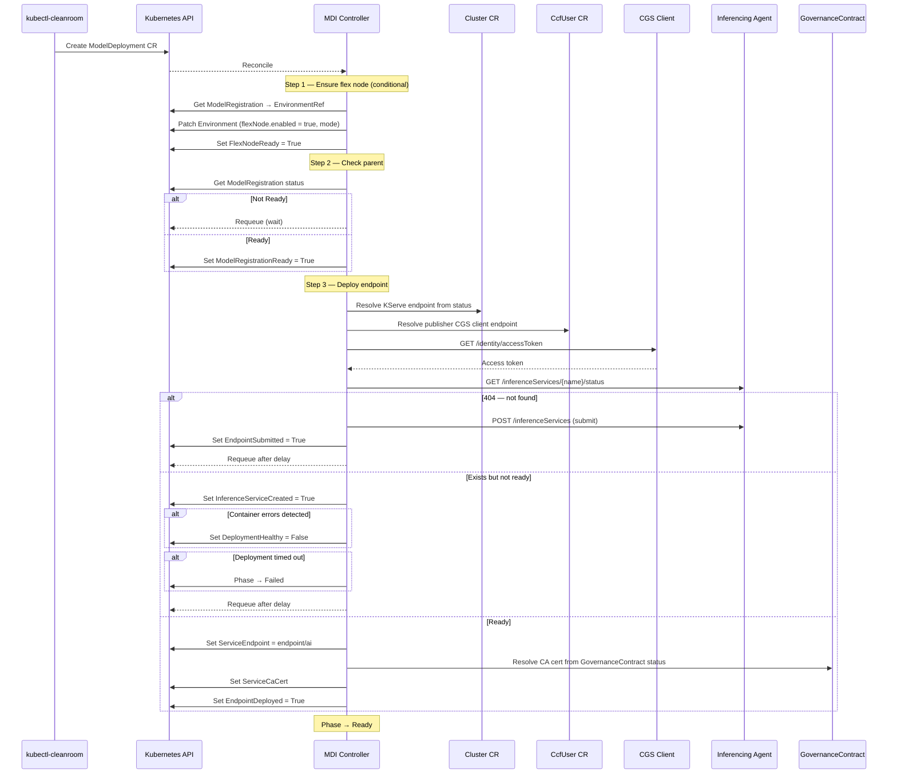

# How It Works: ModelDeployment

A `ModelDeployment` deploys a model inference endpoint on the
workload cluster. It optionally enables flex (SEV-SNP) nodes, waits
for its parent `ModelRegistration` to be Ready, then submits a
deployment request to the inferencing agent and polls until the
service is healthy.

## Conditions

| Condition                 | What it means                                                                 |
| ------------------------- | ----------------------------------------------------------------------------- |
| `FlexNodeReady`           | Environment patched to enable flex nodes (only when NodeProvisioningMode set) |
| `ModelRegistrationReady`    | Parent ModelRegistration has reached Ready phase                                |
| `EndpointSubmitted`       | Deployment request submitted to inferencing agent                             |
| `InferenceServiceCreated` | Inferencing service exists on workload cluster                                |
| `EndpointDeployed`        | Service is ready; ServiceEndpoint and ServiceCaCert populated                 |
| `DeploymentHealthy`       | Set to False when container errors are detected during polling                |

## Status fields

On successful deployment the controller populates:

- `status.serviceEndpoint` — the URL of the deployed inference endpoint
  (cluster KServe endpoint + `/ai`).
- `status.serviceCaCert` — the PEM-encoded CA certificate for TLS
  verification, resolved from the GovernanceContract.
- `status.correlationId` — persisted across reconcile loops to resume
  polling after a controller restart.

## CLI output

```
$ kubectl cleanroom mdi create my-endpoint --model-registration my-model
  ✓ FlexNodeReady
  · Waiting for ModelRegistration to be Ready...
  ✓ ModelRegistrationReady
  · Submitting deployment to inferencing agent...
  ✓ EndpointSubmitted
  · Inferencing service created, waiting for readiness
  ✓ InferenceServiceCreated
  · Waiting for inferencing service to be ready
  ✓ EndpointDeployed
ModelDeployment my-endpoint is Ready
```

## Sequence diagram



## Error handling

If the parent ModelRegistration is in `Failed` phase, the MDI controller
also transitions to `Failed`. Once the parent is fixed and reaches
`Ready`, the MDI controller retries on the next reconcile.

The deployment polling has a timeout (default 10 minutes). If the
inferencing service does not become ready within this period, the
controller sets the phase to `Failed` with reason
`DeploymentTimeout`. Container-level errors (e.g. image pull failures,
OOM kills) are surfaced via the `DeploymentHealthy` condition and
Kubernetes events.

The `correlationId` is persisted in status before submitting the
deployment request, ensuring that on controller restart the controller
can resume polling rather than creating a duplicate deployment.
