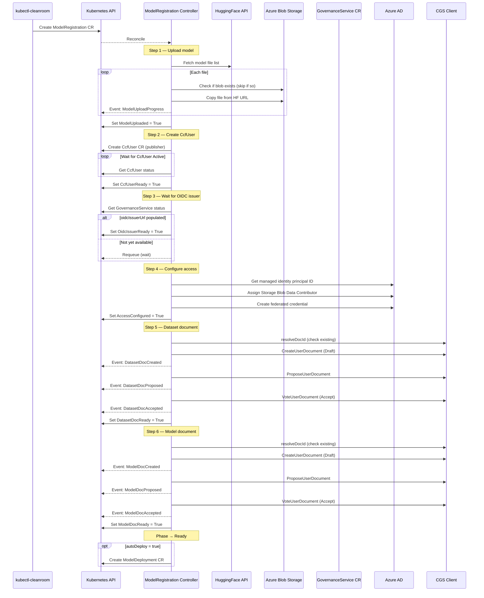

# How It Works: ModelRegistration

A `ModelRegistration` uploads a model to Azure Blob Storage, configures
OIDC-based workload identity, and creates governance documents in CGS
so the clean room workload can access the model. It runs a step
machine — one condition per reconcile loop.

## Conditions

| Condition          | What it means                                                          |
| ------------------ | ---------------------------------------------------------------------- |
| `ModelUploaded`    | Model files copied from HuggingFace to Azure Blob Storage (or skipped) |
| `CcfUserReady`     | Publisher CcfUser created and activated in consortium                  |
| `OidcIssuerReady`  | GovernanceService OIDC issuer URL is available                         |
| `AccessConfigured` | RBAC role assigned, federated credential created                       |
| `DatasetDocReady`  | Dataset governance document created, proposed, and accepted            |
| `ModelDocReady`    | Model governance document created, proposed, and accepted              |

## CLI output

```
$ kubectl cleanroom md create my-model \
    --environment my-env \
    --hf-model-id bartowski/Llama-3.2-1B-Instruct-GGUF \
    --hf-pattern "*Q4_K_M*" \
    --storage-account-id /subscriptions/.../storageAccounts/sa1 \
    --container-name models --encryption-mode CPK
  · Copying file 1/3: config.json
  · Copying file 2/3: Llama-3.2-1B-Instruct-Q4_K_M.gguf
  · Copying file 3/3: tokenizer.json
  ✓ ModelUploaded
  · CcfUser: waiting for activation...
  ✓ CcfUserReady
  · Waiting for OIDC issuer URL...
  ✓ OidcIssuerReady
  · Assigning RBAC role...
  · Creating federated credential...
  ✓ AccessConfigured
  · Dataset document created
  · Dataset document proposed
  · Dataset document accepted
  ✓ DatasetDocReady
  · Model document created
  · Model document proposed
  · Model document accepted
  ✓ ModelDocReady
ModelRegistration my-model is Ready
```

## Sequence diagram



## Governance document lifecycle

Steps 5 and 6 each drive a document through the CGS governance
pipeline: `Draft → Proposed → Accepted`. On resume after a failure,
`resolveDocId` fetches the existing document from CGS and determines
which sub-stage to continue from. This provides idempotent retry
without duplicating documents.

## Error handling

Each step calls `mdSetFailed` with a specific reason on error
(e.g. `DatasetDocCreateFailed`, `ModelDocVoteFailed`). The controller
transitions to `Failed` phase and requeues after a delay. On the next
reconcile, it re-enters the failed step and retries from where it
left off.
