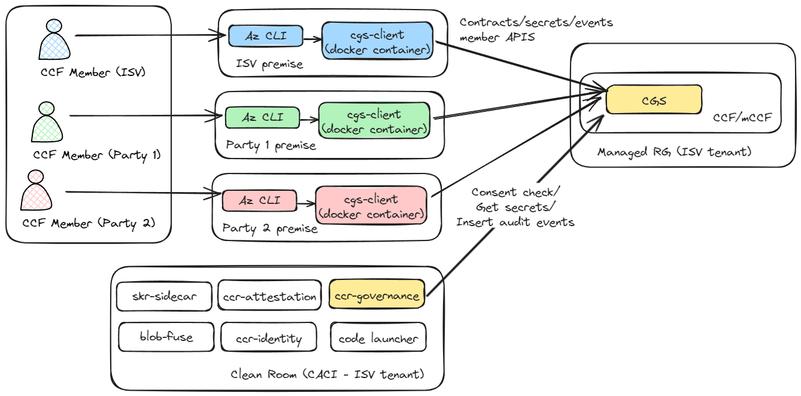
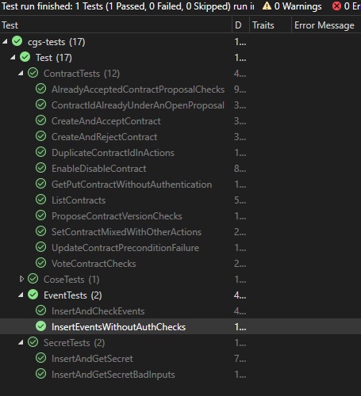

# Clean Room Governance<!-- omit from toc -->
- [Introduction](#introduction)
- [High level layout](#high-level-layout)
- [Local Development](#local-development)
- [Components layout](#components-layout)
  - [ccf-app/js](#ccf-appjs)
  - [client](#client)
  - [sidecar](#sidecar)
  - [ui](#ui)
  - [test](#test)

## Introduction
The Clean Room Governance Service (CGS) provides the following capabilities:
  - Provide a registry for the contracts that govern clean room executions
  - Govern execution of clean rooms by exposing consent check APIs
  - Provides a secret store for sharing secrets that should only be released to clean rooms
  - Acts as an OIDC Issuer/IdP to issue ID tokens to clean rooms for Azure federated credentials
  - Acts as the store for life cycle events related to clean room executions

## High level layout
Clean room governance is realized using the following:
- `CGS`: A clean room governance service (CGS) CCF application
- `cgs-client`: A clean room governance client container named as `cgs-client` that runs on customer's (aka CCF members) premise to interact with the CGS instance.
- `ccr-governance`: A governance sidecar named as `ccr-governance` that runs in the clean room instances and interacts with the CGS service.
- `Clean Room Az CLI commands`: Commands to ease CCF member interactions with the CGS instance.



See the [governance samples README](../../samples/governance/README.md) for details around running these components in a local Docker environment.

## Local Development
To get started and have an end to end development setup that builds and deploys all components for the governance scenario on your local machine, setup do the following in `powershell`:
```powershell
# Build and deploy the governance scenario.
./test/deploy-cgs.ps1
```
To run the unit tests against this instance run:
```powershell
./test/test-cgs.ps1
```
You can also open `governance.sln` in Visual Studio and run the same tests executed as the above script.



If trying out any code changes then re-run the `deploy-cgs` command to deploy the change.

## Components layout
### ccf-app/js
This folder contains the clean room governance service (CGS) implemented as a CCF JS application. See [ccf-app readme](./ccf-app/js/README.md) for more details.

### client
This folder contains the `cgs-client` container code. This container eases interaction with the CGS instance by doing the heavy lifting of interacting with CGS presenting member certificates and COSE signing governance requests using the member certificates. See [client readme](./client/README.md) for more details.

### sidecar
This folder contains the `ccr-governance` sidecar container code. This container eases interaction with the CGS instance by doing the heavy lifting of fetching the attestation report in the CACI intance and presenting the same to the CGS instance to insert events, fetch secrets etc, generating a key pair for encryption/signing that is used for interacting with CGS. See [ccr-governance readme](./sidecar/README.md) for more details.

### ui
This folder contains the MVC application to ease interactions with the CGS instance by providing a web UI.

### test
This folder contains the unit tests for the above components.
