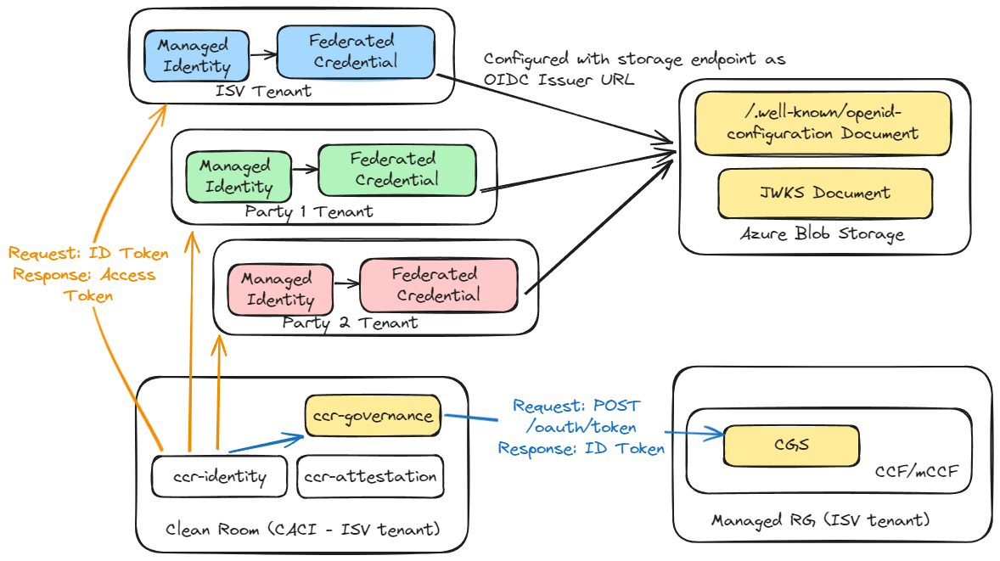

# CGS CCF application<!-- omit from toc -->
- [Endpoints](#endpoints)
  - [Contracts](#contracts)
    - [Deployment spec](#deployment-spec)
    - [Clean room policy](#clean-room-policy)
  - [Events](#events)
  - [Secrets](#secrets)
  - [Oidc](#oidc)
- [OpenID Connect Issuer](#openid-connect-issuer)
  - [Issuer URL endpoint security](#issuer-url-endpoint-security)
  - [Setup a public, secured OIDC issuer URL using Azure Blob Storage](#setup-a-public-secured-oidc-issuer-url-using-azure-blob-storage)
- [Governance upgrade](#governance-upgrade)
- [Links](#links)

## Endpoints
The CGS CCF app exposes the following app endpoints. See [app.json](app.json) for exact endpoint details.

Nodejs/npm install instructions via nvm: https://nodejs.org/en/download/package-manager

### Contracts
[src/endpoints/contracts.ts](src/endpoints/contracts.ts)  
Members can create/update contract instances.
- Exposes contracts in Draft/Proposed/Accepted states.
- Contracts in Draft state can be PUT/PATCH.
- Contracts in Proposed state can be voted.
- Contracts in Accepted state are read-only.
See [contract management](../../../../samples/governance/README.md#contract-management) samples section for more details.

#### Deployment spec
[src/endpoints/deploymentspecs.ts](src/endpoints/deploymentspecs.ts)  
Deployment spec endpoint running in CGS.

#### Clean room policy
[src/endpoints/cleanroompolicy.ts](src/endpoints/cleanroompolicy.ts)  
Clean room policy endpoint running in CGS. The claims specified in this policy is used to authenticate calls coming from a clean room instance for the secrets/events/token APIs that are meant for clean room's consumption.

### Events
[src/endpoints/events.ts](src/endpoints/events.ts)  
Clean room instances can insert events while members can query events. The clean room instance must present a valid attestation report with expected host data and report data values (as set via the clean room policy) for the governance service to accept the event. This ensures that only trusted code running in clean rooms can create audit events in CGS.

### Secrets
[src/endpoints/secrets.ts](src/endpoints/secrets.ts)  
Members can create/update secrets while only clean room instances can get the secerts. The clean room instance must present a valid attestation report with expected host data and report data values (as set via the clean room policy) for the governance service to release secrets. This ensures that only trusted code running in clean rooms can read the secrets stored in CGS.

### Oidc
[src/endpoints/oidc](src/endpoints/oidc)  
OIDC issuer endpoint for the IdP running in CGS. The clean room instance must present a valid attestation report with expected host data and report data values (as set via the clean room policy) for the governance service to create a token. This ensures that only trusted code running in clean rooms can get tokens issued from CGS.

## OpenID Connect Issuer
CGS can act as an Identity provider (IdP)/OIDC issuer and one can leverage [federated identity credential with external identity provider](https://learn.microsoft.com/en-us/entra/workload-id/workload-identity-federation-create-trust-user-assigned-managed-identity?pivots=identity-wif-mi-methods-azp#other) to create a trust relationship between a user-assigned managed identity and CGS as the external identity provider. Microsoft Entra leverages OpenID Connect (OIDC) to discover public signing keys and verify the authenticity of the token issued by CGS before exchanging it for an access token. You can then consume the Microsoft Entra access token to access Azure cloud resources via the Azure Identity SDKs or the Microsoft Authentication Library (MSAL).

OpenID Connect describes a [metadata document](https://openid.net/specs/openid-connect-discovery-1_0.html#ProviderConfig) that contains the metadata of the issuer. This includes information such as the URLs to use and the location of the service’s public signing keys. The following table describes the required OIDC issuer endpoints implemented by CGS:
| Endpoint | Description |
| --- | --- |
| `{IssuerURL}/.well-known/openid-configuration` | Also known as the OIDC discovery document. This contains the metadata about the issuer’s configurations. |
| `{IssuerURL}/keys` | This contains the public signing key(s) that Microsoft Entra ID uses to verify the authenticity of the token issued by CGS.|

Assuming the CGS endpoint is publicly available the `IssuerURL` is of the form `https://{fqdn}:{port}/app/oidc`, eg. `https://cgssvc.duckdns.org:8080/app/oidc` where in `https://cgssvc.duckdns.org` resolves to the the CCF app endpoint IP address, `8080` is the port number that CCF is listening on and `/app/oidc` is the standard (fixed) prefix for CGS.

### Issuer URL endpoint security
- When operating at the level of domain names and DNS entries one cannot securely tie that the FQDN/DNS entry must only resolve to a trusted confidential compute (eg CCF) endpoint. If an attacker can hijack the FQDN/DNS entry then it can redirect the call to a server of its own choosing.
- Thus in a setup where the CGS instance is acting as a OIDC issuer it is not practically possible to assert that the `Issuer` URL endpoint indeed resolves only to the expected CGS instance.
- Simiarly in the federated credentials scenario, when Microsoft Entra ID reaches out to the `Issuer` URL for token signature verification then as long as the endpoint presents a valid SSL certificate Microsoft Entra ID will communicate with it and retrieve the JWKS for token verification.
- In a multi-party collaboration scenario if the `Issuer` URL value is not in control of each party then the entity that controls it could play the role of an attacker. Eg if party 1 can control/hijack the `Issuer` URL configured by party 2 for federated credentials then party 1 can generate a new key pair for token signing, expose the new public key via `{IssuerURL}/.well-known/openid-configuration` and JWKS (`jwks_uri`) endpoints and then create a token, present that to party 2's Microsoft Entra ID tenant and gain access to federated workload credentials configured by party 2.
- To mitigate this threat each party in a collaboration should be able to assert control over the `Issuer` URL that would get used for federated credentials.
  - As each party controls the endpoint that presents the (`/.well-known/openid-configuration`) and JWKS (`jwks_uri`) documents they can set it up so that these endpoints are presenting the values that were taken from CGS OIDC issuer endpoints (see table above). So they are certain that the JWKS points to a key pair whose private key is hosted in CGS and hence only the CGS instance can issue tokens that grants access to their Azure resources.
  - Further CGS would have to issue tokens with the above `Issuer` URL as the value for the `iss` claim. The value of the `iss` claim in the token presented to Microsoft Entra ID and the `Issuer` URL configured by each party in federated credentials must match.

See next section on how each party could setup their own public, secured endpoint as the Issuer URL.

### Setup a public, secured OIDC issuer URL using Azure Blob Storage
In case of CGS running in a CCF instance the `https://<region>.<name>.azurecontainer.io/app/oidc` endpoint would present a self-signed certificate (the service identity certificate of CCF) which will not be trusted by Microsoft Entra when establishing the SSL/TLS connection for federated credentials. Further, even if the CCF endpoint presented a certificate signed by a well-known CA a party in the collabration might want to have control over the endpoint that exposes the public key for token validation (see previous section).

So we need to manually publish the discovery and JWKS documents at an issuer URL endpoint, which should comply with the OpenID specification. This section shows how to set up a secured, public OIDC issuer URL using Azure blob storage and upload a minimal discovery document to the storage account. **Note**: Content heavily adapted from [Azure AD Workload Identity for Self-Managed Clusters](https://azure.github.io/azure-workload-identity/docs/installation/self-managed-clusters/oidc-issuer.html).  



1. **Create an Azure Blob storage account**
    ```pwsh
    $RESOURCE_GROUP="cgs-oidc-issuer"
    $LOCATION="westeurope"
    az group create --name "${RESOURCE_GROUP}" --location "${LOCATION}"

    $AZURE_STORAGE_ACCOUNT="oidcissuer$(openssl rand -hex 4)"
    $AZURE_STORAGE_CONTAINER="cgs-oidc"

    az storage account create `
      --resource-group "${RESOURCE_GROUP}" `
      --name "${AZURE_STORAGE_ACCOUNT}" `
      --allow-blob-public-access true

    az storage blob service-properties update `
      --account-name "${AZURE_STORAGE_ACCOUNT}" `
      --static-website `
      --404-document error.html `
      --index-document index.html

    $webUrl = (az storage account show `
        --name "${AZURE_STORAGE_ACCOUNT}" `
        --query "primaryEndpoints.web" `
        --output tsv)
    ```
1. **Generate the discovery document**
    ```powershell
    @"
    {
      "issuer": "$webUrl${AZURE_STORAGE_CONTAINER}",
      "jwks_uri": "$webUrl${AZURE_STORAGE_CONTAINER}/openid/v1/jwks",
      "response_types_supported": [
        "id_token"
      ],
      "subject_types_supported": [
        "public"
      ],
      "id_token_signing_alg_values_supported": [
        "RS256"
      ]
    }
    "@ > openid-configuration.json
    ```
1. **Upload the discovery document**
    ```powershell
    az storage blob upload `
      --container-name '$web' `
      --file openid-configuration.json `
      --name ${AZURE_STORAGE_CONTAINER}/.well-known/openid-configuration `
      --account-name "${AZURE_STORAGE_ACCOUNT}"
    ```
1. **Verify that the discovery document is publicly accessible**
    ```powershell
    curl -s "$webUrl${AZURE_STORAGE_CONTAINER}/.well-known/openid-configuration"
    ```
1. **Generate the JWKS document**
    ```powershell
    curl -s -k https://<ccfEndpoint>/app/oidc/keys | jq > jwks.json
    ```
1. **Upload the JWKS document**
    ```powershell
    az storage blob upload `
      --container-name '$web' `
      --file jwks.json `
      --name ${AZURE_STORAGE_CONTAINER}/openid/v1/jwks `
      --account-name "${AZURE_STORAGE_ACCOUNT}"
    ```
1. **Verify that the JWKS document is publicly accessible**
    ```powershell
    curl -s "$webUrl${AZURE_STORAGE_CONTAINER}/openid/v1/jwks"
    ```
1. **Update Issuer URL endpoint value in CGS**
    ```powershell
    $issuerUrl="$webUrl${AZURE_STORAGE_CONTAINER}"
    
    # Set at tenant-level. A member can set it directly for the tenant they belong to.
    Set-Oidc-IssuerUrl -url $issuerUrl

    # Or set for all tenants.
    $proposalId=(Propose-Set-Oidc-IssuerUrl -url $issuerUrl | jq -r '.proposalId')
    # Mmembers need to vote and accept the above proposal.
    ```
    See [OIDC Issuer (IdP) management](../../../../samples/governance/README.md#oidc-issuer-idp-management) for more details on how to set the Issuer URL in CGS.

## Governance upgrade
See steps [here](../../../../samples/multi-party-collab/scenarios/upgrade/README.md) for updating the governance client and service upgrade.

## Links
**Workload identity federation**
- https://learn.microsoft.com/en-us/entra/workload-id/workload-identity-federation-create-trust-user-assigned-managed-identity?pivots=identity-wif-mi-methods-azp#other
- https://learn.microsoft.com/en-us/entra/identity-platform/v2-oauth2-client-creds-grant-flow#third-case-access-token-request-with-a-federated-credential
- https://learn.microsoft.com/en-us/entra/identity-platform/certificate-credentials#assertion-format

**JWT tokens**
- https://auth0.com/docs/secure/tokens/json-web-tokens/json-web-key-set-properties
- https://learn.microsoft.com/en-us/azure/attestation/attestation-token-examples#sample-jwt-generated-for-sev-snp-attestation
- https://learn.microsoft.com/en-us/rest/api/attestation/attestation/attest-sev-snp-vm?view=rest-attestation-2022-08-01&tabs=HTTP
