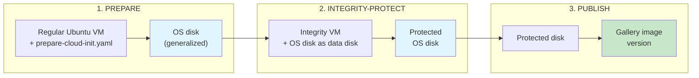

# Flex Node Image Prep

Cloud-init based image preparation for Cleanroom Flex Node VMs. Bakes static
software into a VM image at build time so that the boot only needs
instance-specific configuration.

## Overview

The image lifecycle has three stages:



| Stage | Input | Output | What happens |
|-------|-------|--------|-------------|
| **Prepare** | Regular Ubuntu 22.04 VM + `prepare-cloud-init.yaml` (rendered from vars.yaml) | OS disk (generalized) | Installs containerd, kubelet, CNI, api-server-proxy, kubelet-proxy, cleanroom-boot, GPU drivers |
| **Integrity-Protect** | OS disk | Integrity-protected disk | Applies integrity protection via cvmboot |
| **Publish** | Protected disk | Gallery image version | Exports VHD, creates Azure Compute Gallery image with replication |

## File Structure

```
src/k8s-node/image-prep/
├── pyproject.toml                          # uv workspace package
├── vars.yaml                               # Default template variables
├── README.md                               # This file
├── src/image_prep/
│   ├── __init__.py
│   ├── models.py                           # Pydantic model for template variables
│   ├── scripts/
│   │   └── install-gpu-driver.sh           # GPU driver install script
│   ├── pipeline/                           # Image build pipeline
│   │   ├── cli.py                          # Click CLI (image-prep-pipeline)
│   │   ├── config.py                       # PipelineConfig (BaseSettings)
│   │   ├── common.py                       # az/azcopy wrappers, blob helpers
│   │   ├── render.py                       # Template rendering utilities
│   │   ├── prepare.py                      # Stage 1: prepare
│   │   ├── integrity_protect.py            # Stage 2: integrity-protect
│   │   └── publish.py                      # Stage 3: publish
│   └── templates/
│       ├── prepare-cloud-init.yaml.j2      # Bake-time cloud-init template
│       └── integrity-cloud-init.yaml.j2    # Integrity-protect cloud-init template

src/k8s-node/cleanroom-boot/               # Boot pipeline (Go binary, installed on VM)
├── go.mod
├── cmd/cleanroom-boot/
│   └── main.go                             # CLI entry point + pipeline runner
├── internal/
│   ├── config/config.go                    # CleanroomConfig Go structs
│   ├── status/status.go                    # BootStatus + status.json writer
│   ├── runner/runner.go                    # RunCmd() subprocess wrapper
│   └── stages/                             # Boot stages (Stage interface)
│       ├── stage.go                        # Stage interface + Context
│       ├── loadconfig.go                   # Validate + extract config
│       ├── netplan.go                      # Apply netplan config
│       ├── cni.go                          # Apply CNI bridge config
│       ├── thim.go                         # Wait for THIM cert provisioning
│       ├── flexnode.go                     # Start flex node agent
│       ├── gpu.go                          # GPU detection + configuration
│       ├── apiproxy.go                     # Install api-server-proxy
│       ├── kubeletproxy.go                 # Install kubelet-proxy
│       ├── nodelabel.go                    # Label node boot-complete
│       └── scripts/
│           └── install-gpu-runtime.sh      # GPU runtime install (go:embed)
```

## Build Pipeline

### Building all artifacts

```bash
# Build api-server-proxy, kubelet-proxy, cleanroom-boot, and the VM image
pwsh build/k8s-node/build-cleanroom-flexnode-image.ps1 \
  -repo myacr.azurecr.io \
  -tag v1.0.0 \
  -location germanywestcentral \
  -targetLocations germanywestcentral,eastus \
  -push
```

### Building individual components

```bash
# Build and push api-server-proxy
pwsh build/k8s-node/build-api-server-proxy.ps1 -repo myacr.azurecr.io -tag latest -push

# Build and push kubelet-proxy
pwsh build/k8s-node/build-kubelet-proxy.ps1 -repo myacr.azurecr.io -tag latest -push

# Build and push cleanroom-boot binary
pwsh build/k8s-node/build-cleanroom-boot.ps1 -repo myacr.azurecr.io -tag latest -push
```

### Running the pipeline CLI

```bash
# Full pipeline
image-prep-pipeline all --vars vars.yaml

# Individual stages
image-prep-pipeline render --vars vars.yaml --output ./out
image-prep-pipeline prepare --vars vars.yaml
image-prep-pipeline integrity-protect --os-disk-id <id>
image-prep-pipeline publish --os-disk-id <id>

# With env var overrides
IMAGE_PREP_RESOURCE_GROUP=myRg \
IMAGE_PREP_GALLERY_RESOURCE_GROUP=myGalleryRg \
IMAGE_PREP_LOCATION=westeurope \
IMAGE_PREP_TARGET_LOCATIONS=westeurope,eastus \
  image-prep-pipeline all --vars vars.yaml
```

### Pipeline Configuration

All settings can be overridden via `IMAGE_PREP_*` environment variables:

| Variable | Default | Description |
|----------|---------|-------------|
| `IMAGE_PREP_RESOURCE_GROUP` | `flexnode-image-builder` | RG for builder VMs (transient) |
| `IMAGE_PREP_GALLERY_RESOURCE_GROUP` | (same as resource_group) | RG for gallery + storage (persistent) |
| `IMAGE_PREP_LOCATION` | `eastus` | Azure region |
| `IMAGE_PREP_TARGET_LOCATIONS` | (location only) | Comma-separated replication regions |
| `IMAGE_PREP_BUILDER_VM_NAME` | `flexnode-builder` | Builder VM name |
| `IMAGE_PREP_GALLERY_NAME` | `AzureCleanroomGallery` | Gallery name |
| `IMAGE_PREP_IMAGE_NAME` | `cleanroom-flexnode` | Image definition name |
| `IMAGE_PREP_IMAGE_VERSION` | `1.0.0` | Image version (X.Y.Z) |

## Template Variables

| Variable | Type | Default | Description |
|----------|------|---------|-------------|
| `aks_flex_node_version` | string | `v0.0.17` | AKS Flex Node agent version tag |
| `install_nvidia_gpu_drivers` | bool | `false` | Install NVIDIA GPU drivers in the image |
| `nvidia_driver_version` | string | `580` | NVIDIA driver version number |
| `nvidia_driver_branch` | string | `server-open` | NVIDIA driver branch |
| `api_server_proxy_oci_url` | string | `cleanroomacr.azurecr.io/...` | OCI URL for api-server-proxy |
| `kubelet_proxy_oci_url` | string | `cleanroomacr.azurecr.io/...` | OCI URL for kubelet-proxy |
| `cleanroom_boot_oci_url` | string | `cleanroomacr.azurecr.io/...` | OCI URL for cleanroom-boot binary |
| `image_version` | string | `0.0.0-dev` | Version baked into /etc/cleanroom-image-version |
| `cleanroom_boot_config_dir` | string | `/etc/cleanroom-boot` | Boot config directory |

## Boot Pipeline (cleanroom-boot)

See [`src/k8s-node/cleanroom-boot/README.md`](../cleanroom-boot/README.md)
for the boot pipeline documentation (stages, config envelope, status
reporting, adding stages).

## Monitoring Boot

```bash
# Check boot service status
sudo systemctl status initialize-cleanroom.service

# Follow boot logs in real time
sudo journalctl -u initialize-cleanroom.service -f

# Check boot status
sudo cat /var/run/cleanroom/status.json | jq .
```

## Running Tests

```bash
uv run python -m unittest src/k8s-node/image-prep/test/test_render.py -v
```
