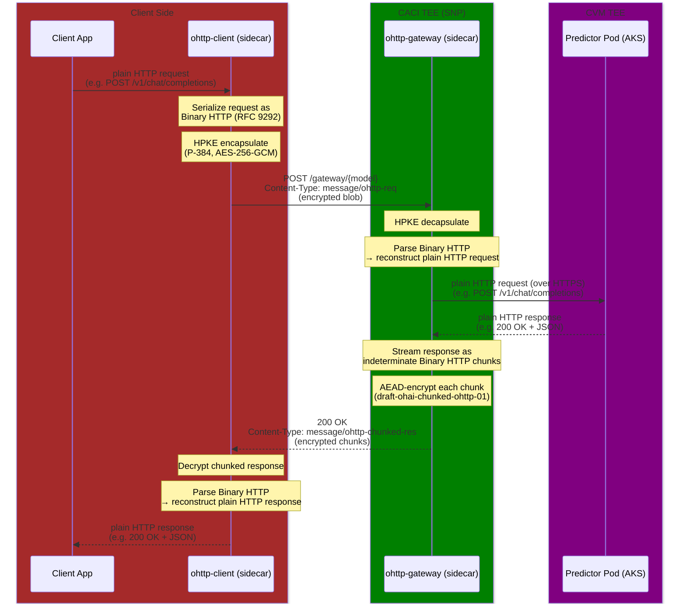
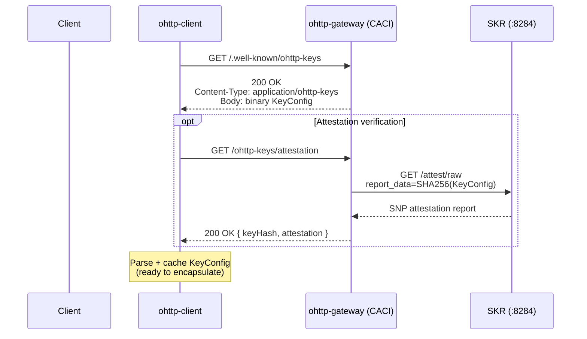
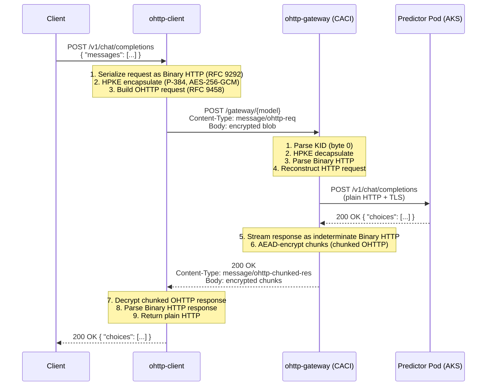
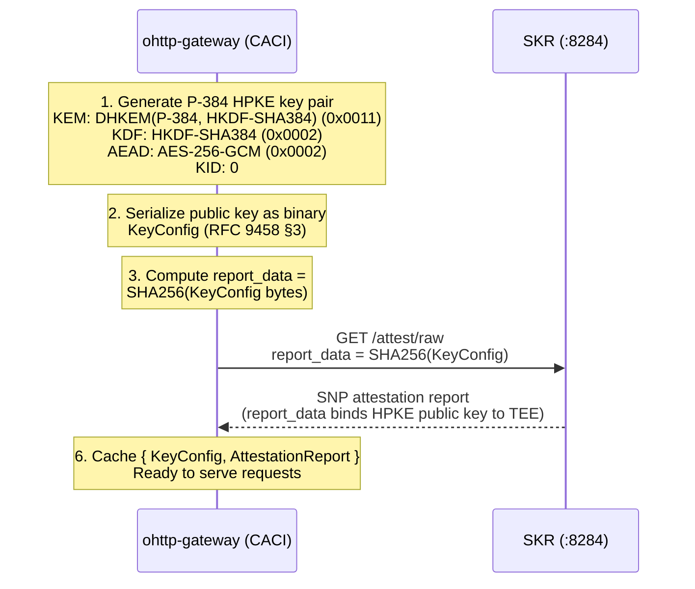

# OHTTP for Confidential Inferencing

End-to-end encrypted inference requests using
[Oblivious HTTP (RFC 9458)](https://www.rfc-editor.org/rfc/rfc9458) over
[HPKE (RFC 9180)](https://www.rfc-editor.org/rfc/rfc9180), with attestation
binding to an Azure Confidential Container Instance (CACI) TEE.

## Overview

This directory contains three C# projects that together provide an OHTTP layer
for confidential inferencing:

| Project | Type | Purpose |
|---|---|---|
| `ohttp-common/` | Class library | Shared HPKE, Binary HTTP (RFC 9292), KeyConfig, OHTTP encap/decap |
| `ohttp-gateway/` | ASP.NET Web API | Service-side sidecar: decapsulate requests, proxy to predictor, re-encapsulate responses |
| `ohttp-client/` | ASP.NET Web API | Client-side reverse proxy: accepts plain HTTP, wraps in OHTTP transparently |

The OHTTP server and client are **inference-framework-agnostic** — they work with
KServe, Seldon Core, or any future serving backend.

## Architecture

### High-Level Flow



### CACI Container Group Layout

The ohttp-gateway runs as an additional container in the existing inferencing
agent CACI deployment, alongside:

```
┌─────────────────────────── CACI Container Group (TEE) ───────────────────────────┐
│                                                                                  │
│  ┌─────────────┐  ┌─────────────────────┐  ┌────────────────┐  ┌──────────────┐  │
│  │ ccr-proxy   │  │ kserve-inferencing  │  │ ohttp-gateway  │  │ ccr-         │  │
│  │ (Envoy)     │  │ -agent              │  │                │  │ governance   │  │
│  │ :443        │  │ :8080               │  │ :8443          │  │ :8300        │  │
│  └──────┬──────┘  └─────────────────────┘  └────────┬───────┘  └──────────────┘  │
│         │                                           │                            │
│  ┌──────┴──────┐                            ┌───────┴────────┐                   │
│  │ Routes TLS  │                            │ Calls SKR for  │                   │
│  │ traffic to  │                            │ attestation    │                   │
│  │ agent/ohttp │                            │ reports        │                   │
│  └─────────────┘                            └───────┬────────┘                   │
│                                                     │                            │
│                     ┌───────────┐  ┌──────────────┐ │                            │
│                     │ SKR       │  │ otel-        │ │                            │
│                     │ :8284     │  │ collector    │ │                            │
│                     └───────────┘  │ :4317        │ │                            │
│                                    └──────────────┘ │                            │
└─────────────────────────────────────────────────────┘────────────────────────────┘
```

## Sequence Diagrams

### Key Discovery and Attestation Verification



### Encrypted Inference Request



### HPKE Key Generation at Startup



## OHTTP Gateway Endpoints

| Endpoint | Method | Content-Type | Standard | Purpose |
|---|---|---|---|---|
| `/.well-known/ohttp-keys` | GET | `application/ohttp-keys` (binary) | RFC 9458 §3 + convention | HPKE public key config (binary `KeyConfig`, not hex) |
| `/ohttp-keys/attestation` | GET | `application/json` | Our extension | SNP attestation report binding `SHA256(HPKE pubkey)` as `report_data` |
| `/gateway/{model-name}` | POST | Req: `message/ohttp-req` → Res: `message/ohttp-chunked-res` | RFC 9458 §4 + draft-ohai-chunked-ohttp-01 | Decrypt, proxy to predictor, streaming encrypt response |
| `/ready` | GET | `application/json` | — | Health check |

### RFC Compliance

- Key config is **binary** `application/ohttp-keys` (not hex-encoded like the
  reference implementation's `/discover`).
- `/.well-known/ohttp-keys` follows the convention used by Cloudflare OHTTP
  Relay and Apple Private Relay.
- Gateway validates `Content-Type: message/ohttp-req` on incoming requests.
- Gateway returns `Content-Type: message/ohttp-chunked-res` for streaming
  responses (draft-ohai-chunked-ohttp-01).
- KID (Key Identifier) is the first byte of the OHTTP request body (RFC 9458).

## OHTTP Client Endpoints

The ohttp-client is a **transparent reverse proxy**. Applications send plain HTTP
to it, and it handles all OHTTP encryption/decryption internally.

### Configuration (environment variables)

| Variable | Required | Description |
|---|---|---|
| `OHTTP_GATEWAY_ENDPOINT` | Yes | Base URL of the ohttp-gateway (e.g., `https://agent.example.com`) |

### Route Patterns

| Incoming Request | OHTTP Target |
|---|---|
| `POST /{model}/v1/chat/completions` | `POST /gateway/{model}` |
| `POST /{model}/v2/models/{m}/infer` | `POST /gateway/{model}` |

### Startup Flow

1. Fetch `KeyConfig` from `OHTTP_GATEWAY_ENDPOINT/.well-known/ohttp-keys`.
2. Cache the `KeyConfig` (refresh on error or periodically).
3. Begin accepting plain HTTP requests on the configured port.

## Cryptographic Parameters

| Parameter | Value | Identifier |
|---|---|---|
| HPKE Mode | Base | 0x00 |
| KEM | DHKEM(P-384, HKDF-SHA384) | 0x0011 |
| KDF | HKDF-SHA384 | 0x0002 |
| AEAD | AES-256-GCM | 0x0002 |
| Key ID (KID) | 0 (single key initially) | — |
| Attestation binding | `SHA256(KeyConfig.encode())` as SNP `report_data` | — |

We use HPKE **Base mode** (RFC 9180 §5.1) — no sender authentication and no
pre-shared key. This is mandated by OHTTP (RFC 9458): the client is anonymous
by design, so Auth or PSK modes would defeat the purpose. The four HPKE modes
are:

| Mode | ID | Sender Auth | PSK | Used Here |
|---|---|---|---|---|
| Base | 0x00 | No | No | **Yes** |
| PSK | 0x01 | No | Yes | No |
| Auth | 0x02 | Yes | No | No |
| AuthPSK | 0x03 | Yes | Yes | No |

## Trust Model

Client verifies trust via the following chain:

1. Fetch KeyConfig (HPKE public key)
2. Fetch SNP attestation report
3. Verify `report_data == SHA256(KeyConfig bytes)` → fail: reject key
4. Verify SNP report signature chains to AMD root of trust → fail: reject key
5. Check SNP measurements match expected CACI security policy → fail: reject key
6. All checks pass → use KeyConfig for HPKE encapsulation

The private HPKE key never leaves the CACI TEE. Even the cloud operator cannot
extract it — it exists only in encrypted memory protected by AMD SEV-SNP.

## Comparison with Microsoft Reference Implementation

This section compares our approach with the three reference repositories from
Microsoft's Azure AI Confidential Inferencing:

- [`microsoft/attested-ohttp-server`](https://github.com/microsoft/attested-ohttp-server) —
  Rust OHTTP gateway for confidential GPU VMs
- [`microsoft/attested-ohttp-client`](https://github.com/microsoft/attested-ohttp-client) —
  Rust OHTTP client with Python bindings
- [`microsoft/azure-transparent-kms`](https://github.com/microsoft/azure-transparent-kms) —
  CCF-based Key Management Service

### Architecture Comparison

| Aspect | Reference Implementation | Our Implementation |
|---|---|---|
| **Language** | Rust (server + client), TypeScript (KMS) | C# / .NET 10 (all components) |
| **Components** | 3 separate repos | 3 projects in 1 directory (`ohttp/`) |
| **Server framework** | warp (Rust) | ASP.NET Web API (controller-based, same pattern as inferencing-agent via `ApiMain`/`ApiStartup` from `restapi-common`) |
| **Client form factor** | CLI binary + Python wheel (`pyohttp`) | Transparent HTTP reverse-proxy sidecar |
| **TEE type** | Confidential GPU VM (NVIDIA H100) | Azure Confidential Container Instances (CACI, AMD SEV-SNP) |
| **Deployment** | Standalone VM processes | Kubernetes sidecar containers in CACI pod |

### Key Management Comparison

| Aspect | Reference Implementation | Our Implementation |
|---|---|---|
| **Key generation** | External CCF-based KMS (`azure-transparent-kms`) generates keys | ohttp-gateway generates ephemeral keys locally on startup |
| **HPKE curve** | P-384 (NIST) | P-384 (NIST) |
| **Key storage** | CCF KV store with Merkle receipts | In-memory only — never persisted |
| **Key distribution** | KMS → RSA-wrap → GPU VM → TPM decrypt | Generated in TEE, never exported |
| **Key rotation** | KMS creates new keys, server fetches by KID | Restart generates new key (KID=0) |
| **Key lifecycle** | Long-lived (24h cache, KMS-rotated) | Ephemeral per CACI instance |

**Rationale**: The reference uses an external KMS because confidential GPU VMs
need a trusted third party to generate HPKE keys and attest their provenance
via CCF receipts. Our CACI TEE can generate its own keys — the TEE *is* the
trust anchor, and the SNP attestation report directly binds the public key to
the TEE's identity. This eliminates an entire service (KMS) from the
architecture.

### Attestation & Trust Chain Comparison

| Aspect | Reference Implementation | Our Implementation |
|---|---|---|
| **TEE attestation** | GPU attestation (NVIDIA) + MAA token | AMD SEV-SNP attestation via SKR sidecar |
| **Attestation proxy** | Custom `azure-attestation-proxy` Unix socket daemon | Existing SKR sidecar (:8284), shared with inferencing agent |
| **Key-to-TEE binding** | KMS receipt proves key was generated in CCF; MAA token proves server runs in TEE | SNP report's `report_data` = `SHA256(HPKE public key)` — single proof binds key to TEE |
| **Client verification** | Verify CCF receipt (Merkle proof + ECDSA sig) against KMS service cert | Verify SNP attestation report + `report_data` matches `SHA256(KeyConfig)` |
| **verifier location** | Client-side (`verifier/` crate) | Client-side (can be done in ohttp-client or by the application) |

**Rationale**: The reference requires a two-step verification (CCF receipt for
key provenance + MAA token for server TEE) because the KMS and the OHTTP server
are separate trust domains. In our design, key generation and request handling
happen inside the same TEE, so a single SNP attestation report is sufficient.

### Protocol Comparison

| Aspect | Reference Implementation | Our Implementation |
|---|---|---|
| **Key discovery endpoint** | `GET /discover` (hex-encoded, local testing only) | `GET /.well-known/ohttp-keys` (binary, RFC-compliant) |
| **Key config format** | Hex-encoded string | Binary `application/ohttp-keys` (RFC 9458 §3) |
| **Gateway endpoint** | `POST /score` | `POST /gateway/{model-name}` |
| **Model routing** | Single target (`-t http://127.0.0.1:8000`), `enginetarget` header override | Model name in URL path → `{model}-predictor-https...svc:443` |
| **Response streaming** | Chunked OHTTP (`message/ohttp-chunked-res`) | Chunked OHTTP (`message/ohttp-chunked-res`) with indeterminate-length Binary HTTP |
| **Header injection** | `--inject-request-headers` CLI arg (outer→inner) | Outer request headers forwarded to predictor |
| **Attestation token** | `x-attestation-token` response header (MAA token) | Separate `/ohttp-keys/attestation` endpoint (SNP report) |

### Client Comparison

| Aspect | Reference (`attested-ohttp-client`) | Our (`ohttp-client`) |
|---|---|---|
| **Form factor** | CLI tool (`ohttp-client-cli`) and Python wheel (`pyohttp`) | HTTP reverse-proxy sidecar |
| **Usage model** | Application invokes CLI or imports `pyohttp` — must construct Binary HTTP, handle OHTTP directly | Application sends plain HTTP to `localhost:{port}` — zero OHTTP awareness |
| **Key fetch** | Fetches from KMS `/listpubkeys` + verifies CCF receipt | Fetches from `/.well-known/ohttp-keys` + (optional) SNP attestation verification |
| **Programming language** | Rust (with Python bindings via PyO3/maturin) | C# (same as server, shared `ohttp-common` library) |
| **Dependencies** | Requires Rust toolchain to build `pyohttp` wheel | Standard .NET 10 — no additional toolchain |
| **Integration effort** | Application must be modified to use `pyohttp` API | Drop-in sidecar — change URL from `https://model-endpoint/...` to `http://localhost:8080/...` |

**Rationale**: The reference client requires applications to be OHTTP-aware —
they must import `pyohttp`, construct Binary HTTP messages, and handle
encapsulation directly. Our reverse-proxy approach means **any** HTTP client
(curl, Python requests, any language) works without modification. The
application just points at a localhost endpoint.

### Pros and Cons Summary

#### Our Approach — Pros

1. **Simpler architecture**: No external KMS. Key generation, attestation, and
   OHTTP processing all happen in the same CACI TEE.
2. **Single attestation proof**: One SNP report binds the key to the TEE
   (vs. CCF receipt + MAA token).
3. **Transparent client**: Applications need zero OHTTP knowledge. Just change
   the base URL to point at the ohttp-client sidecar.
4. **Inference-framework-agnostic**: The ohttp-gateway works with any backend
   (KServe, Seldon Core, custom) — it just forwards HTTP to the predictor
   service URL.
5. **Consistent language**: All C# / .NET 10, matching the rest of the
   azure-cleanroom repo. No Rust toolchain needed.
6. **Shared code**: `ohttp-common` library is used by both server and client —
   one implementation of HPKE, Binary HTTP, and OHTTP framing.

#### Our Approach — Cons

1. **No key persistence across restarts**: Ephemeral keys mean clients must
   re-fetch `KeyConfig` when the CACI instance restarts. The reference's
   KMS-backed keys survive server restarts.
2. **No centralized key management**: If multiple CACI instances serve the
   same model, each has a different HPKE key pair. Clients must discover the
   right key for each instance. The reference's KMS provides a single key
   for all servers.
3. **C# HPKE implementation**: The reference uses a mature Rust `ohttp` crate.
   We implement HPKE in C# using native .NET cryptography (P-384 ECDH,
   AES-GCM, HMAC-SHA384) — less battle-tested for this specific use case,
   but with zero external crypto dependencies.
4. **No Python client library**: The reference provides `pyohttp` for direct
   Python integration. We rely on the sidecar pattern instead — which is more
   general but requires running an additional container.

#### Reference Approach — Pros

1. **Production-hardened**: Used in Azure AI Confidential Inferencing with
   NVIDIA H100 GPUs.
2. **Key rotation via KMS**: CCF-backed key lifecycle with receipts and audit
   trail.
3. **Mature OHTTP implementation**: Rust `ohttp` crate and `bhttp` crate are
   well-tested RFC implementations.
4. **GPU attestation**: Supports NVIDIA GPU attestation in addition to CPU TEE.

#### Reference Approach — Cons

1. **Complex architecture**: Three repos, three services (KMS + server + client),
   multiple attestation layers (GPU + MAA + CCF receipt).
2. **External KMS dependency**: Requires a running CCF network
   (`azure-transparent-kms`) — substantial operational overhead.
3. **Client modification required**: Applications must use `pyohttp` or the
   Rust CLI — no transparent proxy option.
4. **Rust toolchain**: Building `pyohttp` requires Rust + maturin. Not all
   environments have this readily available.
5. **Non-standard key discovery**: `/discover` endpoint returns hex-encoded
   `KeyConfig` — deviates from RFC 9458 and the `/.well-known/ohttp-keys`
   convention.

## Standards and References

| Standard | Description |
|---|---|
| [RFC 9458](https://www.rfc-editor.org/rfc/rfc9458) | Oblivious HTTP |
| [RFC 9180](https://www.rfc-editor.org/rfc/rfc9180) | Hybrid Public Key Encryption (HPKE) |
| [RFC 9292](https://www.rfc-editor.org/rfc/rfc9292) | Binary Representation of HTTP Messages |
| [draft-ohai-chunked-ohttp-01](https://datatracker.ietf.org/doc/draft-ohai-chunked-ohttp/) | Chunked Oblivious HTTP Messages |
| [AMD SEV-SNP](https://www.amd.com/en/developer/sev.html) | Secure Encrypted Virtualization — Secure Nested Paging |